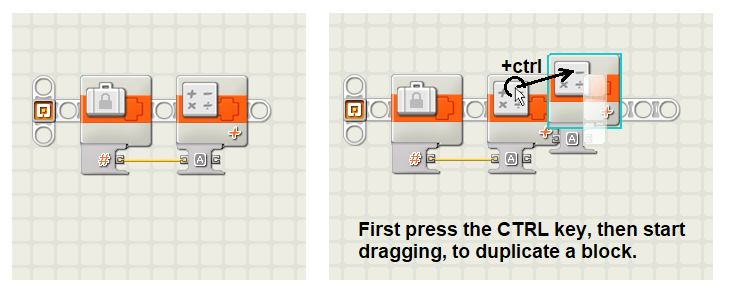
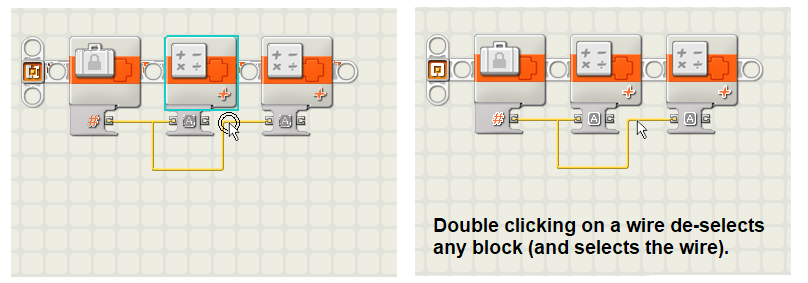

# Lego NXT
Hints, tips, and tricks for the LEGO NXT Mindstorms robotics system.

## Links
- [8527 retail 1.0](https://www.lego.com/biassets/bi/4520729.pdf)
- [8547 retail 2.0](https://www.lego.com/biassets/bi/4589647.pdf)
- [Hints by Coert Vonk](https://coertvonk.com/family/school/inquiries/lego-mindstorms-nxt-g-6107)

## The Lego NXT-G

NXT-G is the IDE (integrated development environment) that comes with Lego Mindstorms NXT.
It does have its quirks; this chapter has some tips.

First tip: ctrl-drag to duplicate a block.

A not so convenient feature: blocks are auto selected.

Autoselection of blocks makes selecting wires harder. Tip: double click the wire.

If a wire is selected, a press on [Delete] deletes the whole tree. Tip: click the input port to delete just the branch.

Want to make some space on the beam? Just drag a technic pin. If you hoover to long before clicking, it _branches_ the beam instead of making place (see next tip).
This dragging also works to remove space.

Branching a bea, is very subtle. First hoover over the branch point until it "highlights" (very subtle). Then drag towards a new block that you placed before.

## Blocks 

### Integer math

NXT 1.0 uses integer math, but NXT 2.0 uses floating point. However the _Integer Math_ block is also installed but not published in the LEGO IDE.
To add the Integer Math Block, create an empty file `Numeric Operations.txt` in the `Data` directory in

`C:\Program Files (x86)\LEGO Software\LEGO MINDSTORMS NXT\engine\EditorVIs\BlockRegistry\`**`Data\Numeric Operations.txt`**

By the way, all installed blocks can be found here `C:\Program Files (x86)\LEGO Software\LEGO MINDSTORMS NXT\engine\vi.lib\LEGO\Blocks`.

Found this tip See [here](http://linearactuator.blogspot.com/2009/08/interger-blocks-in-nxt-g-20.html).

### Create your own blocks
Never tried it, but it seems you can make your own block using [labview](ftp://ftp.ni.com/evaluation/mindstorms/NXT_Creating_MINDSTORMS_Blocks.pdf).

## Firmware problems

### Resetting the NXT
If the running icon stops spinning, the NXT has frozen and you must reset it. Follow these steps to reset the NXT:
1. Make sure that the NXT is turned on.
2. Press the reset button that is located on the back of your NXT in the Technic hole in the upper left corner. 
3. If you press the reset button for more than 4 seconds, you will need to update the firmware.

### Clicking brick
The NXT firmware has either been deleted or is corrupty. But the brick and its bootloader is still working.
See [here](http://www.legoengineering.com/clicking-brick-syndrome/) for details.

In some cases you have a driver problem.
1. Open device manager and find under ""Ports (COM & LPT) the "Bossa Program Port" driver and select "update driver".
2. Via "Browse my computer for driver software" then "Let me pick from a list..." find "LEGO MINDSTORMS NXT" driver instead. 
3. Then it is possible to connect to "LEGO MINDSTORMS NXT 2.0" and update firmware.

Found this tip [here](https://home.et.utwente.nl/slootenvanf/2016/04/15/lego-firmware/). Here is a procedure from [Lego Service desk](https://bricks.stackexchange.com/questions/2624/nxt-brick-will-not-update-firmware).

(end)
