# Lego Mindstorms Robot Inventor "Mindstorms 4" 51515 FAQ

This FAQ has been written from the perspective of using a _Windows PC_ as host, not e.g. a tablet.


## How to switch off the brick?
I opened the box, and one of the first things I did was to power on the brick.
However, I could not figure out how to switch it off.

You have the first download the "IDE" (next question) on your PC (probably MAC also works, but phone doesn't) and then
upgrade the Hub OS. Only then I was able to switch the hub off.

How? Keep the big button pressed, it gives three beeps, and then you can release.
In some cases (Python program running instead of a Word Block) I do not hear the three beeps.


## Where is the Lego software?
The booklet tells you to visit [https://www.lego.com/devicecheck](https://www.lego.com/devicecheck).
I skipped that, because I have a brand new PC and a brand new Android device.
But then I wondered where should I _download_ the Mindstorms software?

Well, go to [devicecheck](https://www.lego.com/devicecheck), select mindstorms,
and click on of the "stores" to download the app.

You might like to try the [Spike prime software](https://education.lego.com/en-us/downloads/spike-prime/software).
It seems identical, and it has support for the force sensor, whcih is missing in the Mindstorms app. Did not try.

## How to make a shortcut to the app on my Windows Desktop?
I don't like "apps" from the Windows store. They are special in all kind of ways.
For example how do you create a shortcut on your desktop?

Go to Start > Run (e.g. Windows-R) and enter `shell:AppsFolder`.
This pops up a folder with app, and you can drag a shortcut to e.g. your Desktop.

Found [here](https://winaero.com/desktop-shortcut-store-app-windows-10/).


## What are the technical specs of Mindstorms 4?
Lego has leaflets on [Spike prime](https://education.lego.com/en-us/support/spike-prime/technical-specifications), which
is largely the same.

- **hub**: 5x5 LEDs, 6 ports, Gyro, 3 buttons one with RGB LED, beeper, Bluetooth, USB, MicroPython
  **cpu:** 100MHz M4, 320 kB RAM, 1M FLASH; 32MB RAM extern
  **battery**:  2100 mAh @ 7.3 V  >500 cycles
- **color sensor**: 100 Hz sample rate,  color sensing (RGB/HSV), reflectivity sensing, ambient sensing, white led emission
- **distance sensor**: 100 Hz sample rate, range 50..2000 mm, resolution 1 mm, 4 LEDs for decoration
- **motor**: torque 0..18 Ncm, speed 0..185 RPM, current 110..800 mA;
  **rotation sensor**: 360 ticks per revolution, 3 degrees accuracy, 100 Hz sampling


## Which projects can I build?
Of course, there are the five robots that come with the box.
Building instructions are digital only, you can find them in the app via Help > Settings > Building instructions.
Or you can click the robot in the home screen, and go from there in smaller steps.
Do note that the robots come with add-ons, which are really great,
for example [charly drum master](https://youtu.be/EAHvnpIGu1U)
or [tricky chain reaction](https://youtu.be/szFxBSRUh7c?t=167)

If you like more, or simpler builds, you could have a look at [Spike prime instructions](https://education.lego.com/en-us/support/spike-prime/building-instructions)


## Where are my recent projects?
When you start the Lego Mindstorms Robot inventor app, you get a screen with pictures (links) to the 5 robots.
At first this is nice, but after a while you want to continue with your own projects.

You have to click PROJECTS at the bottom of the app's home screen.
Unfortunately, thw list of projects starts with the standard lego ones, and not with e.g. the most recent ones.
You have to scroll all the way down.

The Lego app is very limited in using _keys_. The DownArrow doesn't work. Fortunately PageDown does work.
So does the scroll wheel. The scroll bar itself is too thin to easily grab with the mouse. Grr.


## How should I name my projects?
Most projects end up with a name like `Project 17`, because the Lego app does not ask for a name.
By default it just numbers them, using the lowest free number.

You have to explicitly remember to press Save As (preferably right after you create a new project). Grr.


## How do I start a new project?
Want to start a new project? Press CODE at the bottom of the home screen. You get an empty new Word Block
program. Rather have a Python program? In the Word Block editor (top) create a new tab.
Or, in the home screen click File > New Project.

Now you are _asked_ for the type of project (Word Block or Python).

After creating the project I suggest to immediately rename with File > Save As.


## Where are my projects saved?
The lego app made a directory `C:\Users\maarten\Documents\LEGO MINDSTORMS` for my (Maarten's) projects.
If you Save As `xxx`, the file ends up there, as `xxx 1.lms`.

The extension probably refers to Lego MindStorms. The "space-one" suffix is automatically appended.
The next time you Save As a project and _type_ `xxx` it gets the name `xxx 2.lms` (note the `2`).
Non standard windows behavior. Grr.

You can however Save As and _select_ the existing `xxx 1.lms`.
That pops up an "are you sure you want to overwrite" dialogue.


## What is a .lms file?
The Lego app saves Mindstorms projects as files with the extension `.lms` (Lego MindStorms presumably).
This is a binary file format, which is a pity especially for Python programs.

However, it turns out to be an archive. If you have, e.g. [7zip](https://www.7-zip.org/) you can unzip the lms file.

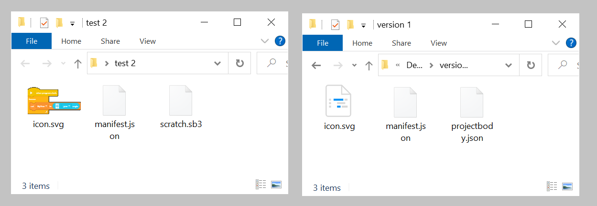

This `icon.svg` is the icon displayed on the projects page. For a Python program it is a fixed one, for a Word block program it is a "picture" of the program.

The `manifest.json` contains unknown details. I have freely formatted it for readability (e.g. removed all details of the `frames` field for the word block).

```text
{                                                                {
  "type":"word-blocks",                                            "type":"python",
  "autoDelete":false,                                              "autoDelete":false,
  "created":"2020-10-26T11:40:45.552Z",                            "created":"2020-10-27T09:01:52.735Z",
  "id":"TWLdDSlhsQyc",                                             "id":"oU3m7qCYhOst",
  "lastsaved":"2020-10-27T19:07:51.938Z",                          "lastsaved":"2020-10-27T09:47:52.208Z",
  "size":19529,                                                    "size":1148,
  "name":"test 2",                                                 "name":"version 1",
  "slotIndex":0,                                                   "slotIndex":0,
  "workspaceX":119.99999999999989,                                 "workspaceX":120,
  "workspaceY":119.99999999999955,                                 "workspaceY":120,
  "zoomLevel":0.675,                                               "zoomLevel":0.5,
  "showAllBlocks":false,                                           "hardware":{
  "version":6,                                                       "python":{
  "hardware":{                                                         "name":"LEGO Hub A8:E2:CC:BB:EE:DD",
    ":V-eSnh?r]sx%eM7=Sn|":{                                           "connection":"bluetooth-classic",
      "id":"COM4",                                                     "lastConnectedHubId":"a8:e2:cc:bb:ee:dd",
      "description":"",                                                "id":"a8:e2:cc:bb:ee:dd",
      "connection":"usb",                                              "type":"flipper"
      "name":"LEGO Hub",                                             }
      "type":"flipper",                                            },
      "hubState":{"programRunning":false},                         "state":{}
      "lastConnectedHubId":"COM4"                                }
    }
  },
  "extensions":["flipperevents","flippersensors"],
  "state":{
    "playMode":"play",
    "canvasDrawerTab":"monitorTab",
    "canvasDrawerOpen":true
  },
  "animations":{
    "Q62qCPATcnucgz9Ldm_T":{
      "params":{
        "transition":2,
        "frames":[{"pixels":[...]}...],
        "loop":false,
        "fps":8,
        "animationName":"Play"
      },
      "lastSave":1603712445547,
      "id":"Q62qCPATcnucgz9Ldm_T"
    }
  }
}

```

The third file is the actual program. For Word blocks some for me unknown format.
For Python, it is Python text wrapped in json, below freely formatted by me for readability.

```json
{"program":"
   import sys\n
   \n
   # print( dir(sys) )\n
   # for n in dir(sys): print( \"sys.\"+n+\" = \", eval(\"sys.\"+n) )\n
   \n
   print( \"byteorder=\", sys.byteorder )\n
   print( \"implementation=\", sys.implementation )\n
   print( \"maxsize=\", sys.maxsize )\n
   print( \"path=\", sys.path )\n
   print( \"platform=\", sys.platform )\n
   print( \"version=\", sys.version )\n
   \n
"}
```

## How to save my project?
There is no Save button.

It seems the project is saved constantly when you interact with it (clicking the tab is enough).
I see the time stamp change in the file explorer.

The only condition is that the project is non-empty, or that you did a Save As.
So, an empty project that is not renamed does not yet get saved.


## Can I "remote control" my robot?
A bit hidden feature in the Word Block IDE are the two icons on the right hand side.

The top one (Remote Control) allows you to create a "Remote Control" pane in the IDE, with _widgets_.
The widgets on the PC pane communicate via Bluetooth to the Hub.
On the hub they trigger events that can be used in your program.

Great feature! Missing are widgets that _output_ content; most _input_ events in you program.
For example a virtual LED would be nice, or a string box, or a string list (dare I say "console").

There is one serious drawback: the program [needs](https://www.lego.com/en-us/service/help/products/themes-sets/lego-mindstorms-robot-inventor/coding-with-the-lego-mindstorms-robot-inventor-app-408100000020946#:~:text=Because%20Streaming,running) to execute in streaming mode (ie live connection to the PC).

The remote control is not present in Python - probably because it has no streaming mode.

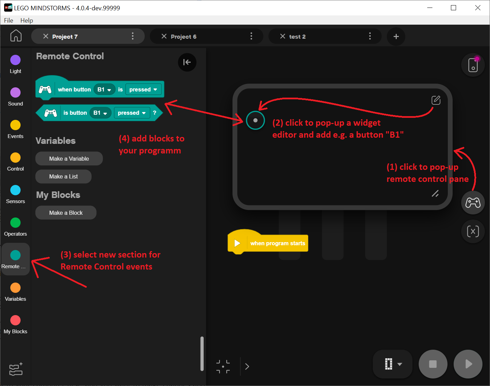


## Can I remote control my robot with a game controller?
At this moment in beta, there is the option to add support for game controllers (Sony, XBox).

Click the Block Extension button and then either enable the DualShock or XBox One controller.
New blocks will pop-up in your palette (left).

I assume the controllers send their "button presses" via bluetooth to the PC, the stream to the hub.
I don't have one so can not test.

There is one serious drawback: the program [needs](https://www.lego.com/en-us/service/help/products/themes-sets/lego-mindstorms-robot-inventor/coding-with-the-lego-mindstorms-robot-inventor-app-408100000020946#:~:text=Because%20Streaming,running) to execute in streaming mode (ie live connection to the PC).

The remote control is not present in Python - probably because it has no streaming mode.

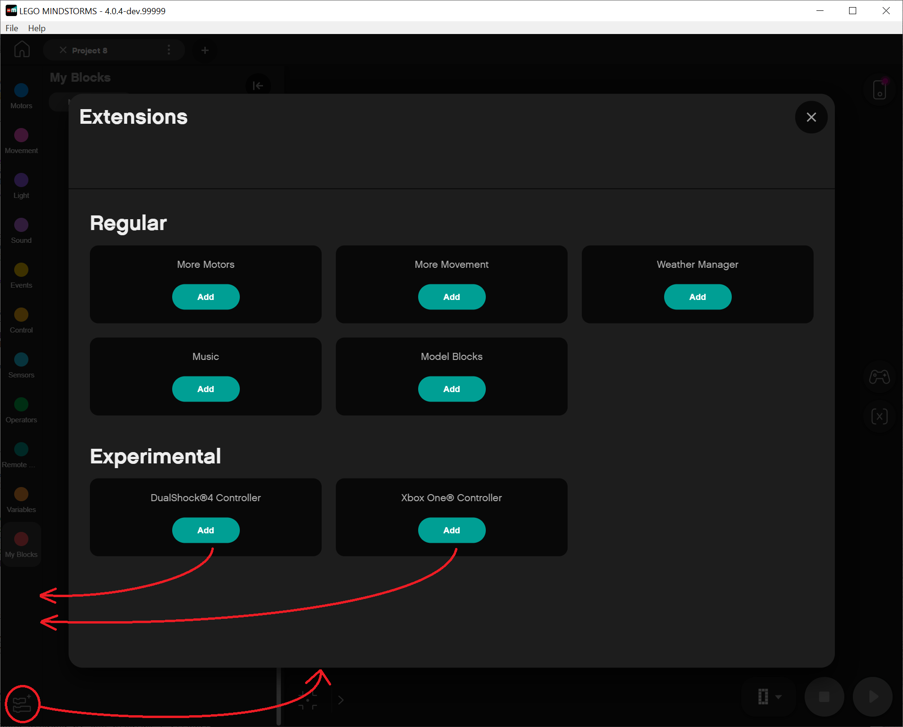


## How can I debug my Word Block program?
A bit hidden feature in the Word Block IDE are the two icons on the right hand side.

The bottom one (Show/Hide Monitor) allows you to show (hide) a pane with a live view of the variables.

Great feature! Not present in Python, but Python has a better feature: the console!
A downside is that the monitor updates periodically (timed), so you do not see all changes.

The monitor feature does work in "download mode", you  do not have to use "streaming mode". I did expect that...

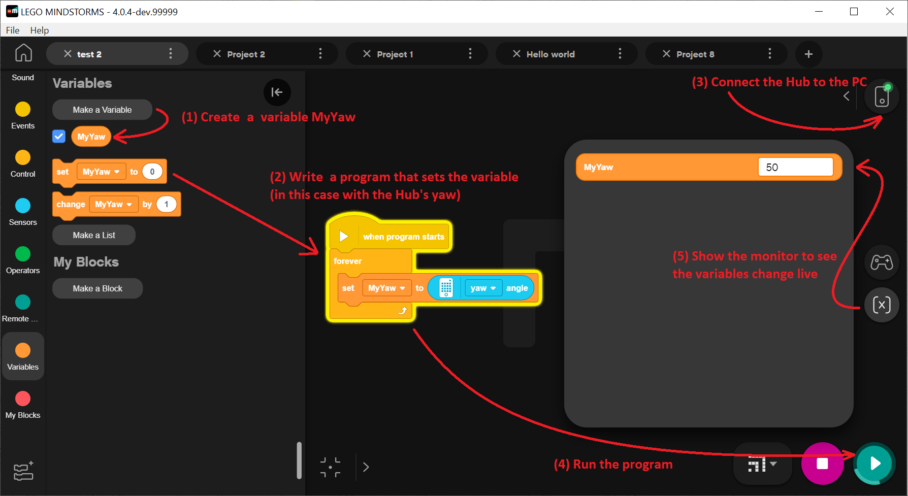


## How can I debug my Python program?
Python lacks the monitor feature. Bummer!
But it does have something better: a console.

You can just `print()` in the hub code, and the print result is send to the PC console.

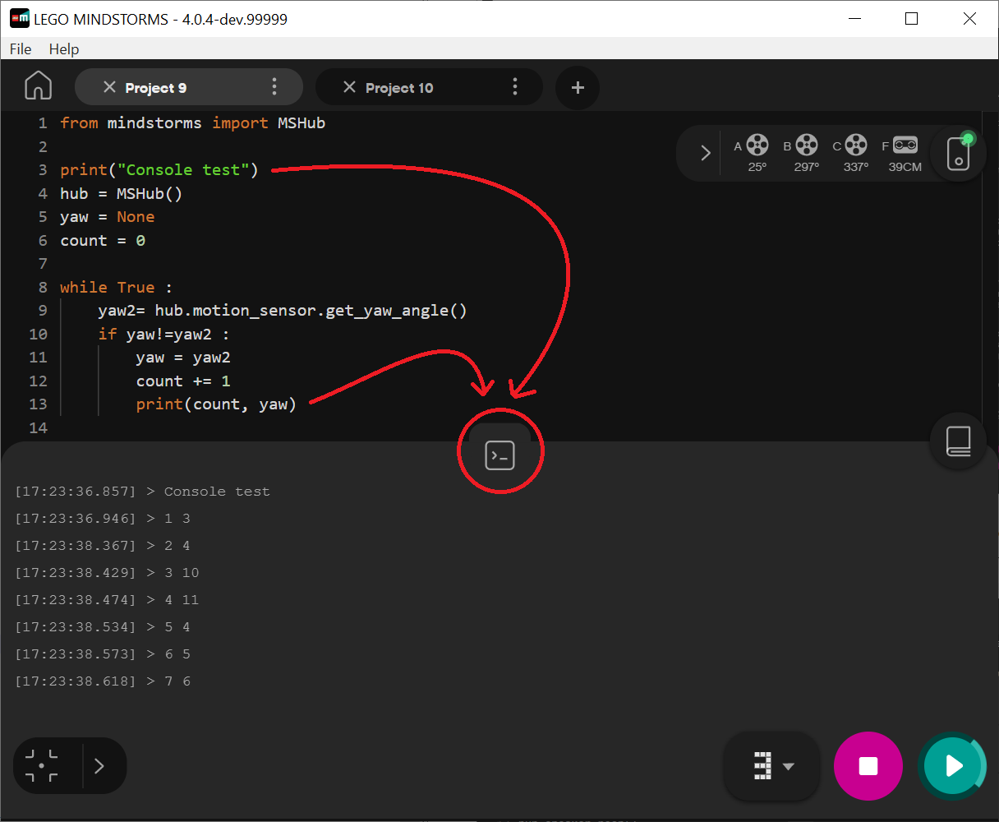

I have not yet found a way to `input()` - that is a pity.


## How to send my project to the Hub?
There are actually three ways to do that.

- The most straighforward way is to press the Play button.
  Your program is compiled, uploaded and run. if a program was running on the hub, it is stopped.
  Note that the Hub has 20 slots(0..19), the app calls them "storage positions".
  By default your program goes to slot 0, but if you click the slot select button, you can specify another one.

  If you open the Hub connection on the PC, and then select tab Programs,
  you see the slots with the names of the project they store. Plus the option to delete or reorder slots.

- Another way it to only download, not _run_: press the Download button in the slot selection pane.

- A special way to run is _streaming_ mode.
  It does not save the project in a slot. So code is lost after stopping the program.
  Python does not support streaming.

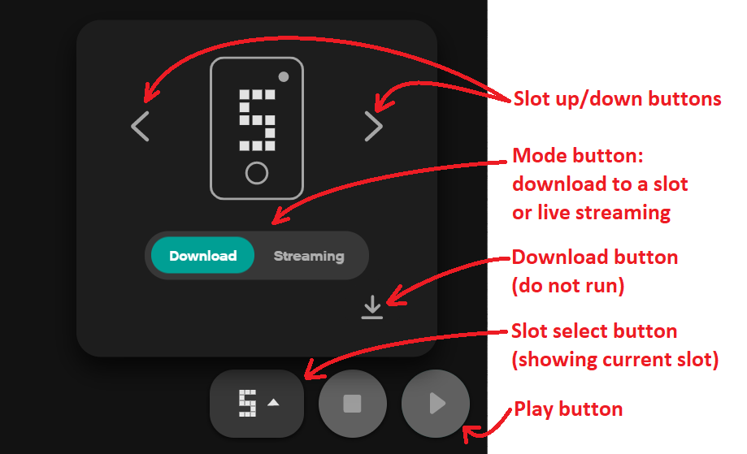


## What is streaming?
I'm not entirely sure of all the details of [streaming mode](https://www.lego.com/en-us/service/help/products/themes-sets/lego-mindstorms-robot-inventor/coding-with-the-lego-mindstorms-robot-inventor-app-408100000020946).

- The program you’re creating is not stored in a slot on the hub as is with download mode.
- Instead, the PC maintains a connection with the hub, and the instructions will stream to the hub as they are executed.
- You can make "live" changes in your program (see figure).
- Streaming is faster.
- Remote control (pane in Mindstorms app, or Game controller) requires streaming mode.
- Somehow, showing the monitor does not require streaming mode.
- Also, sound via PC does not require streaming mode.
- I don't know yet if e.g. the "weather" extension needs streaming.

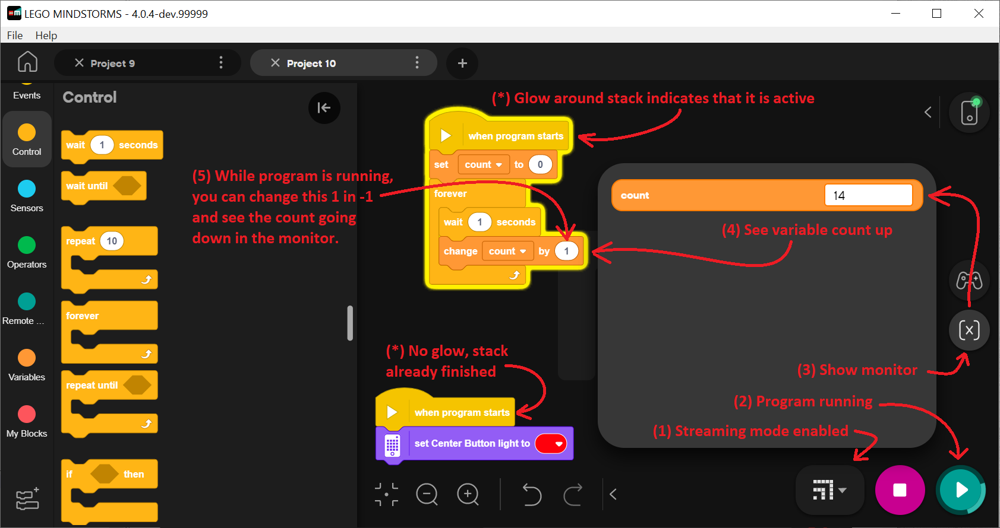


## Isn't streaming mode slow?
In streaming mode, the code is streamed from the PC to the hub, while the program is executed.
This sounds a bit like an interpreter, and thus it sounds slow.

It isn't. In fact, it is the other way around: streaming is nearly 1000x faster.
Disclaimer: my test program does not execute a balanced set of blocks, and that is an understatement.

I guess the reason for this is that in streaming mode, all the code is run on the PC, and only _actuator commands_ and _sensor reads_ are streamed to the hub.

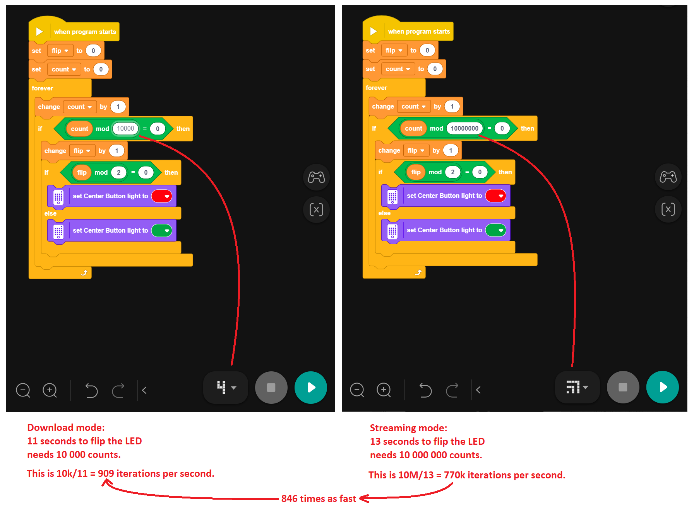


## Is there help (API documentation) for Word Blocks?
Yes, sort off. If you press Settings in the home screen, or Help > Setting, you can pick _Help and Support_ and then
_Word block description_. This has a two or three lines of help per block.

It has a very bad document structure (hard to see sections), does not support copy and paste, and worst of all,
can not be opened while programming. Grr.

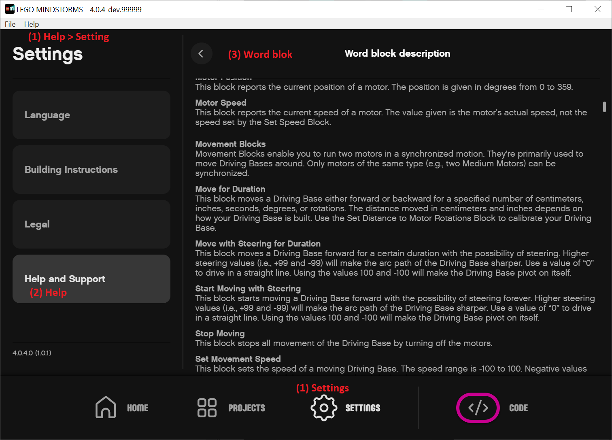


## Is there help (API documentation) for Python?
The help for Python is found on the right had side in the Python editor.

It is better than the help for Word Blocks. Document structure is better but not good.
Does support copy and paste (although not for every piece of text).
Can be open during programming (pfeew).

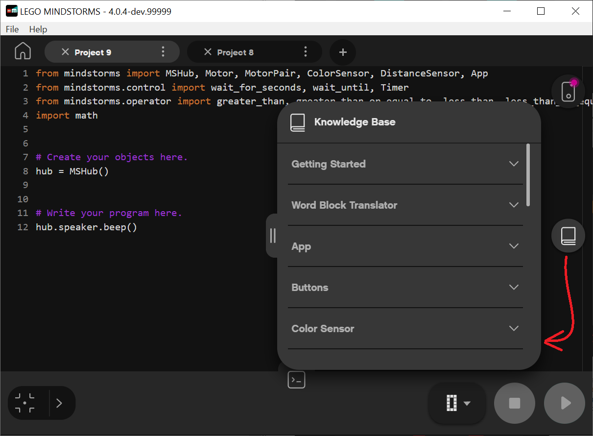


## How to stop my program?
Good question: if you program doesn't stop, the hub will not power down, so stopping is important.

In Word block, there is an explicit stop block.

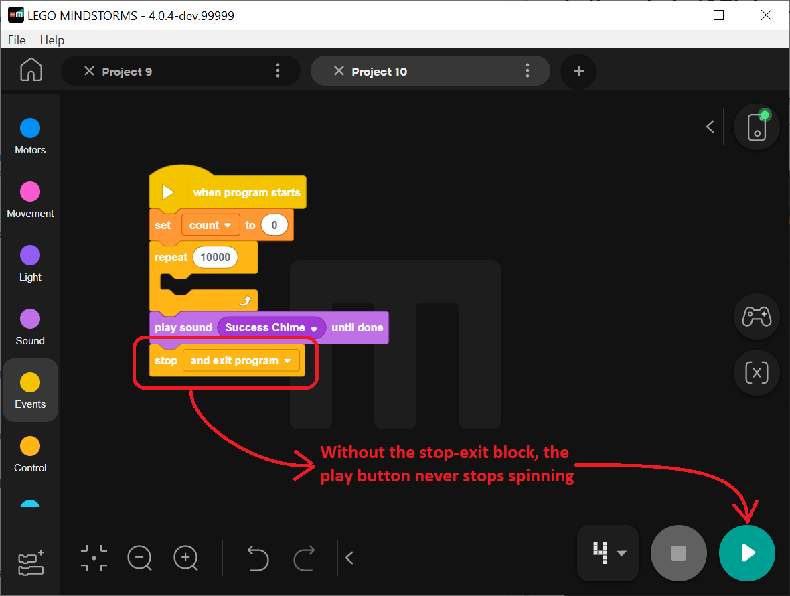

In Python, I haven't found a good one yet. I did find `sys.exit(0)` (don't forget the `import sys`).
It does stop the program, but with a sort-of error.
You can see this in the console (red message), but also the center LED on the hub flashes red 3 times.

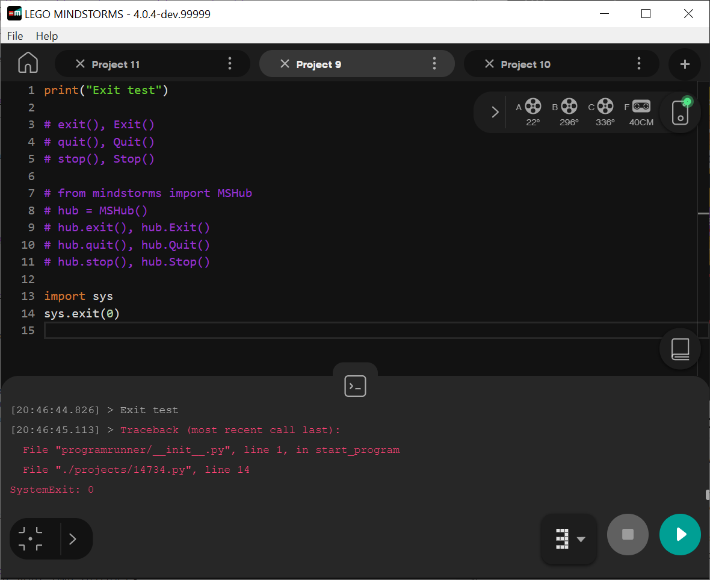

Instead of using `sys.exit()`, we can also use `raise SystemExit`, which is more or less the
[same](https://docs.python.org/3/library/exceptions.html#:~:text=exception%20SystemExit,function.).
It also suffers from the same problem: red message in console and red flashes on hub.

## What is degrees, position and relative position?

The motors in Mindstorms 4 are a bit different then the earlier ones (NXT and EV3).
The motors in the last 3 generations of Mindstorms all have a position sensor, but the one in Mindstorms 4 is _absolute_.
So, for example, it not only knows that it _moved_ 45 degrees, it also knows it is _at_ 60 degrees (assuming the motor started at 15).
The "0 degrees" is arbitrary, but it is marked on the motorhub.

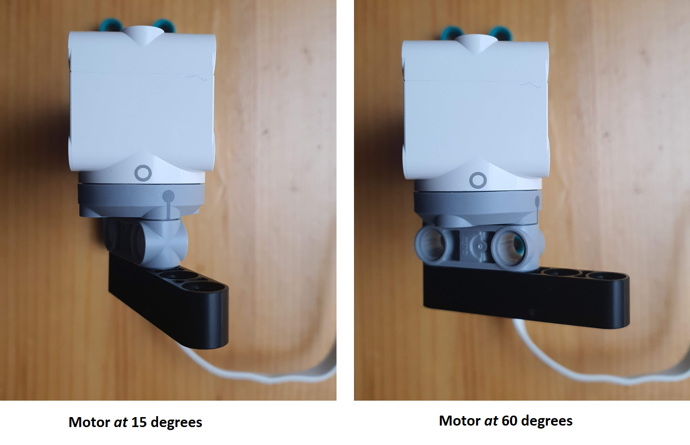

So, a motor moves _degrees_ (or _rotations_), the "delta", thereby moving from one absolution _position_ to another absolute _position_.
A _position_ is always a number from (including) 0 to (excluding) 360.
The _degrees_ to move can be any number, even fractional (not very exciting) or negative (turn the other way around).

The absolute sensor is nice for "non drive wheel motors". When motors are used for driving, they turn and turn, and there is no "zero" position.
But when motors are used for a door, a windshield wiper, a swinging radar, a clock, the robot needs to know where the "zero" position is.
In the past you needed a touch sensor for that (or drive the motor to a mechanical stop). But no longer in Mindstorms 4.

There is one small problem though: when a motor rotates, the _position_ sensor wraps around: it goes from 357, 358, 359, 0, 1, 2.
To solve this, there is a second "sensor" _relative position_. This one keeps on counting.
In the screenshot below, the motor moved (by hand actually) nearly 1.3 rotation. The _relative position_ recorded this as 460 degrees, but the _position_ of the hub is 100 degrees.

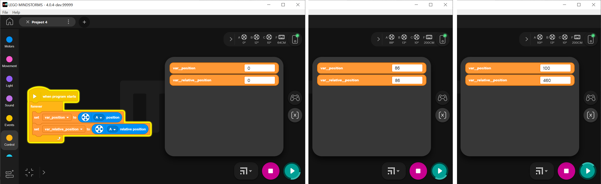

For me the term _relative position_ is a bit confusing, I expected something like "cumulative degrees".
But it is clear the _position_ is actually "absolute position" (lego just dropped the "absolute"), so the other one is "relative" :-)

The _position_ sensor is located in the "Motors" section of the Word blocks palette,
but for the _relative position_ sensor you need to enable the extension "More Motors".

One last word, some of my motors seem to be ~10 degrees off with respect to their "zero mark".
It is structural, so that is easily fixed by adding a correction of 10.


## What are all those (blue) Motor blocks?

At first, the amount of motor block is overwhelming. Let's look at the blue blocks first: "Motors".

The color (and name) is a first important hint: the blue blocks ("Motors" and "More Motors") operate on a _single_ motor.
The pink blocks ("Movement" and "More Movement") operate on _two_ motors, the left and right one for movement (driving).

Actually, that is a lie (but a simplification that helps understanding).
The pink Movement blocks control _two_ motors and _keeps them in sync_. If one stops (break it with your hand), the other stops as well.
Think of a bulldozer with a left and a right track, they need to move at the same speed for the bulldozer to go straight.
The blue motor blocks on the other hand, control one motor. So there is no syncing.
And yes, you can use a blue block to control two motors in one go, but they are _not_ synced.

Back to the blue blocks.

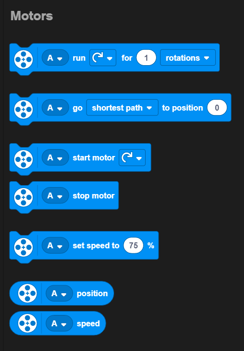

The first block tells the _selected motor(s)_ to move, either in _rotations_, _degrees_, or _seconds_.
You can specify the _amount_ and the _direction_ (clockwise or counter clockwise).
Note that if the amount is negative, it also reverse the direction.

The only thing that is missing is speed. Lego decided to exclude speed from the motor blocks.
Instead they have a separate set-speed block (5th in the figure above); it sets the default speed for that motor.
We will see that some blocks do have a speed parameter, this takes precedence over the default speed.
If there is no set-speed block to set the default speed, the defaults is 75%.

The second block is similar, but instead of setting an amount, we set a target _position_.
Note that we can force the direction (clockwise or counter clockwise), or let the motor take the shortest path.

The first two blocks have a target (in rotations, degrees, seconds, or position).
These blocks switch on the motor(s), waits till the target is reached, and switch off the motor.
Only then the block finishes and the next block will be executed.

Block 3 and 4 split this start-wait-stop; they are needed when the target is not know when starting the motor.
There is no amount, just direction (also here the speed comes from the set-speed block).
Block 3 start-motor starts a motor, and then the block finishes and the next block is executed - but the motor keeps on rotating.
At some moment - e.g. a sensor sees that the robot gets close to a wall - block 4 stop-motor is executed.
By the way, note the subtle spacing in the figure above: block 3 and 4 belong together, the spacing is narrow.

Block 5 sets the default speed as discussed above.

Block 6 and 7 have a different shape.
The first 5 are known as _Stack Blocks_ in [scratch](https://en.scratch-wiki.info/wiki/Blocks), I would call them _statements_.
Block 6 and 7 are known as _Reporter Blocks_, I would call them (integer or string) _expressions_.
In this case they are special form of an expression: they are a function call to a sensor.
The _position_ gives the (absolute) position of the motor (0..359), and _speed_ the actual speed.
Note that speed is _not_ the speed set with the set-speed block, but the actual speed of the (running) motor.

There are more blue block: there is an extension with the obvious name More Motors.
Roughly they add a speed parameter.

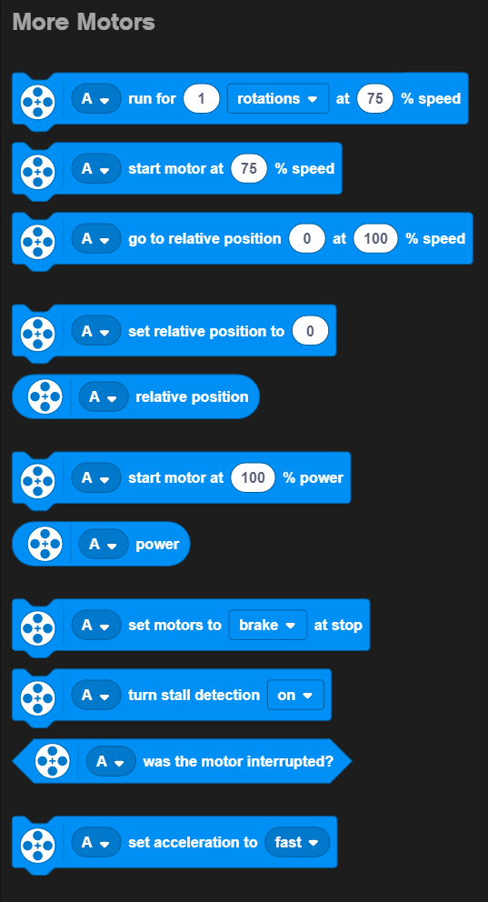

The first "more motors block" is similar to the first "motors block".
It tells the _selected motor(s)_ to move, either in _rotations_, _degrees_, or _seconds_.
You can specify the _amount_ but not explicitly the _direction_ (you can do that by negating the amount).
What is extra is that we can override the default _speed_.
Note that if the speed is negative, it also reverse the direction.

The second "more motors block" is similar to the third "motors block".
It switches the motor on. No direction, but there is _speed_.
Also here, if the speed is negative, direction is reversed.

The third one is similar to the second: it goes to a position.
But in this case a _relative position_ so there is no need for a path (clockwise or counter clockwise).

Note that _relative position_ is like a software variable.
It tracks changes in _position_, but it does not reset when _position_ transitions from 359 to 0.
With block 4 set-relative-position we can write that variable (usually reset it to 0), and with block 5 we can read it (find how much degrees the motor rotated since reset).

The next two blocks (6 and 7) are about _power_. I guess they measure current through the motors as opposed to RPM.
Have not used this.

The stop and stall blocks (8, 9 , 10) are not working for me - do not understand them.

Have not used the acceleration.

Note that set-motor-stop, set-stall-detection, and set-acceleration, are settings, like set-speed.


## What are all those (pink) Movement blocks?
Why are there pink Movement blocks next to the blue Motor blocks?

The pink Movement blocks control _two_ motors and _keeps them in sync_. If one stops (break it with your hand), the other stops as well.
Think of a bulldozer with a left and a right track, they need to move at the same speed for the bulldozer to go straight.
The blue motor blocks on the other hand, control one motor. So there is no syncing.

The crux is the motors are kept in sync. You will mostly use them for driving, but you could also control two windshield wipers.
Because they are often used for driving, we see one more unit for _amount_: centimeters (ok two: also inches).
For this to work, we need to set the circumference of the wheel.

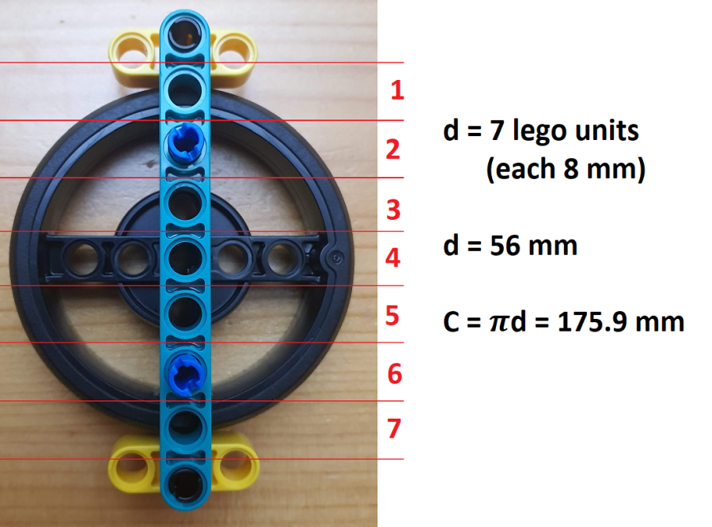

As we see, the standard wheel has a circumference of 175.9 mm, and indeed that is the default setting as we can see in the 7th pink block.
The 6th block is probably even more important: it identifies which two ports are used for the movement motors.
Please note that A+B is different then B+A: the direction reverses.
The 5th block is the default speed setting for the movement motors.
This explains the last three block (5, 6, and 7), the settings blocks.

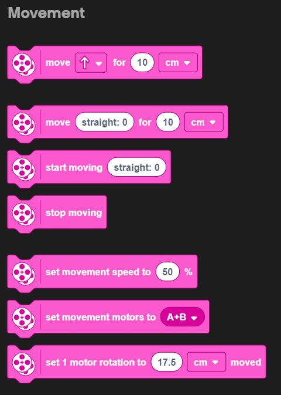

The blocks that are left (1-4) are familiar.
We have two target blocks (1 and 2), where we can set the target (in cm, inch, rotations, degrees, seconds).
We have the no-target blocks (block 3 and 4) that start and stop.
All block have in common that we need to set the "synchronisation" between the motors.

The first block allows forward and backward (both motors same speed), or left and right (one motor still, the other rotating).

The second and third block allow to fine-tune the speed ratio between the wheels.
This is a bit funny: up to 95% both motors go in the same direction, but one slower and slower (at 95% it is nearly stopped).
However, at 100% the "slow" motor suddenly runs at full speed in reverse. See question below on move graph.

We can also add an extension, properly named More Movement.

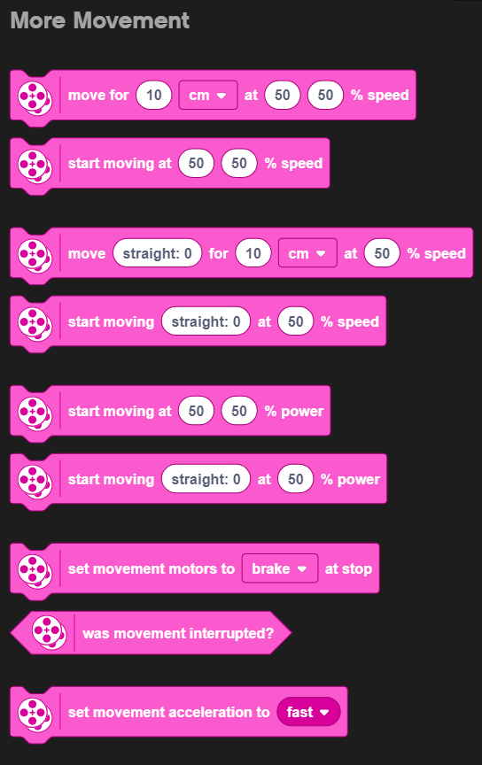

As with the blue blocks, now the speed is part of the blocks, overriding the default.
The difference with blue is that we need to set the speed for both motors.
So either there are two speed parameters, or one "steer" and one "speed".
Also here we have blocks that use power (motor current?) instead of speed (motor RPM).

And I have the not yet understood stop, stall or acceleration blocks.


## How to update the hub firmware?
I see people talk about hub firmware updates, but the Mindstorms app does not have a feature for that - at least I couldn't find it. Maybe the Spike prime app allows explicit firmware updates (downgrades, alternatives...).

However, when lego releases a new version, you will get a message in the app. If you accept it the hub will be updated.
This updates the hub’s OS, not the user data (saved projects).


## What are the hotkeys?
I think lego did a bad job here. Many functions are not operatable by key.
Probably lego aims at touch screens.

Note #=shift, ^=ctrl, @=alt

Word blocks is horrible
  - ^Z for undo is working, but ^Y for redo isn't (it is available in bottom menu or right click menu)
  - @F4 stops aplication.
  - @F or @H (for file or help menu) is _not_ working.
  - Cut and paste (^C, ^V) is _not_ working. You can right-click and Duplicate, but this duplicates the whole stack.
  - I found no hotkey for Run or Download.
  - Cursor keys (panning) do nothing.

Python is better. But not due to Lego, but because they took a standard control for the editor.
It behaves much like [Microsoft Studio Code](https://code.visualstudio.com/shortcuts/keyboard-shortcuts-windows.pdf)
  - ^C, ^V, ^X for copy, paste, cut.
  - ^Z, ^Y for undo, redo.
  - Cursor movement with arrow or page keys, optionally in combination with ^.
  - Select by pressing # while moving cursor.
  - ^F, ^H for find and replace (grr: the hub bar overlaps with the find bar).
  - **^#P issues a play**.
  - ^#D issues a download.
  - **There is no way to clear the console other than to restart the whole mindstorms app - grr**.
  - **You can only walk up (arrow-up, page-up) in the console, not down, and the scroll bar sucks - grr**.
  - Fancy line commenting: ^K^C add line comment, ^K^U delete line comment, ^/ toggle line comment.
  - #@A to toggle block comment.
  - Very fancy multi cursor (bit over the top) with @click, or ^#@ with cursor movement.
  - **There is no rich languages editing, ^SPC appears to work but it doesn't know the object, it just shows all occuring strings.**


## What software version is current?
What is "current"?

At the moment of writing this answer (2020 oct 27):

- The IDE version is 4.0.4-dev.99999
- The Hub OS version is 2.1.4.10

This can be seen from a screenshot

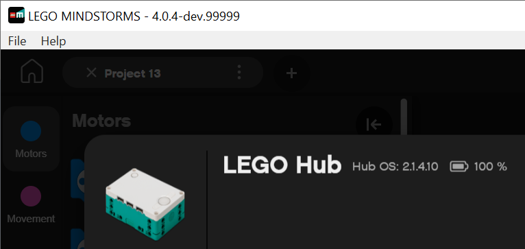


## Which Python is used?
Let's write a script for that! See screenshot.
- Micro Python 1.11.0
- on system 3.4.0

No idea how that relates to the Hub OS version.

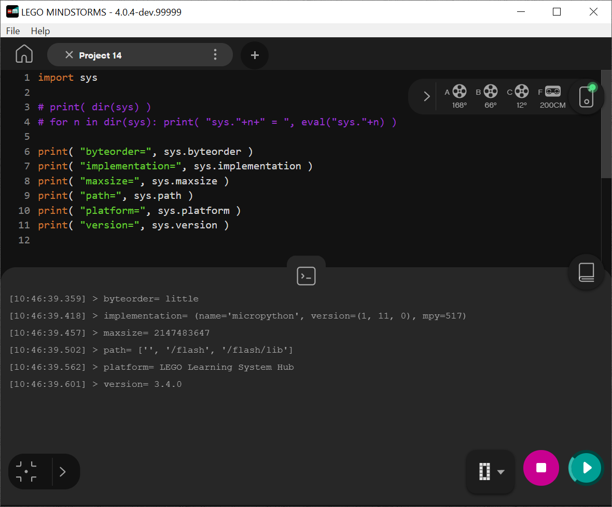


## Can I connect to REPL - interactive Python?
Yes you can ([instructable](https://www.instructables.com/MicroPython-on-SPIKE-Prime/)).
The Python interpreter in the Hub has an interactive command shell that executes a so-called read-eval-print loop (REPL).
The Hub has two serial links, one over Bluetooth and one over USB. Both are enabled for REPL.

Connect the Hub to your PC either via Bluetooth, or, easier, a USB cable.
Right click on the Windows start button and select Device Manager, and fold open the _Ports (COM & LPT)_ section. It requires some experimentation (e.g unplug USB to see which port disappears) to determine which port(s) connect to the Hub. In my case it is COM4 (serial over the USB link) and COM5 (serial over Bluetooth).

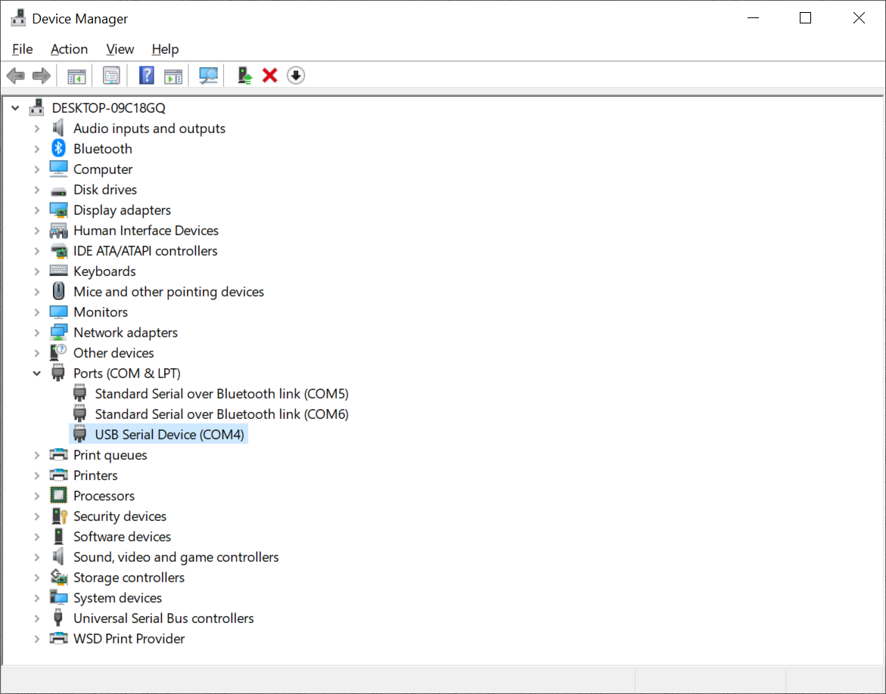

Next, we need a terminal program to send an receive commands over serial. I happen to use an oldy [realterm](https://realterm.sourceforge.io/), but [putty](https://www.putty.org/) is a popular alternative.

Configure the COM port (115200/8/N/1), and connect.
The hub is running a program that spits out data, and this now floods the terminal.
Stop the program by sending a CTRL-C.
We get a prompt from `MicroPython v1.11-1139-gf7407e5a0 on 2020-06-19; LEGO Technic Large Hub with STM32F413xx`

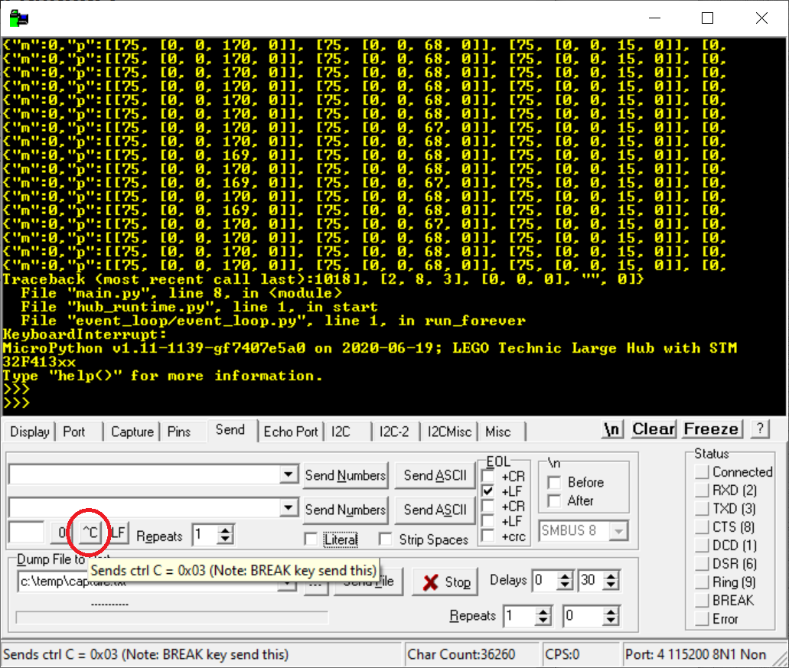


## What can I do in REPL - interactive Python?

A good start is the trusted `dir()` command.

```text
>>> dir()
['hub_runtime', 'gc', '__name__', 'micropython']
```

The `gc` object [controls the garbage collector](https://docs.micropython.org/en/latest/library/gc.html),
variable `__name__` holds the value `'__main__'`, and
object `micropython` helps in [access and control of the internals](https://docs.micropython.org/en/latest/library/micropython.html).
Our best candidate is `hub_runtime`.

If you want to know what such an object offers, use `dir` again (`dir(hub_runtime)`).
Even better, this REPL offers command completion with the TAB key.
For example, after type `hu`TAB, we get `hub_runtime`, if we then type `.`TAB we get

```text
>>> hub_runtime.
__class__       __name__        start           __file__
BT_VCP          Timer           USB_VCP         hub
init            LightMethods    LinegraphMonitorMethods
MotorMethods    MoveMethods     SoundMethods    WaitMethods
ProgramMethods  HubMethods      get_event_loop  register_ports
TIMER_PACE_HIGH                 error_handler   pop_force_reset
RTTimer         notify_gesture_event            RPCProtocol
system          ProgramRunner   HubUI           runtime
scratch         sensors         __connection_changed
>>> hub_runtime.
```

After some searching, we can get the current yaw via a call to the `position`.
We called twice, rotating the hub in between.
First number looks like the yaw.

```
>>> hub_runtime.hub.motion.position()
(25, -1, 0)
>>> hub_runtime.hub.motion.position()
(44, -1, 0)
>>>
```

The `help()` command as suggested when we pressed ^C is _not_ very useful.

```text
>>> help()
Welcome to MicroPython!

For online help please visit http://micropython.org/help/.

Quick overview of commands for the board:
  hub.info()    -- print some general information
  hub.status()  -- print sensor data

Control commands:
  CTRL-A        -- on a blank line, enter raw REPL mode
  CTRL-B        -- on a blank line, enter normal REPL mode
  CTRL-C        -- interrupt a running program
  CTRL-D        -- on a blank line, do a soft reset of the board
  CTRL-E        -- on a blank line, enter paste mode
  CTRL-F        -- on a blank line, enter filetransfer mode

For further help on a specific object, type help(obj)
For a list of available modules, type help('modules')
>
```

The `hub.info()` does not work: `name 'hub' isn't defined` (we already knew that, `hub` was not listed by `dir`).
The CTRL commands seem a bit advanced now.
There is one good hint though: `help("modules")`.

```text
>>> help("modules")
__main__          math              uerrno            urandom
_onewire          micropython       uhashlib          ure
builtins          sys               uheapq            uselect
cmath             uarray            uio               ustruct
firmware          ubinascii         ujson             utime
gc                ucollections      umachine          utimeq
hub               uctypes           uos               uzlib
Plus any modules on the filesystem
```

This lists the module `hub`! Let's try to import it, and give the status command.

```text
>>> import hub
>>> hub.status()
{'gyroscope': (2, 8, 3), 'position': (51, 0, 0), 'accelerometer': (15, -8, 1026)
, 'port': {'C': [0, -2, 12, 0], 'D': [], 'B': [0, 2, 70, 0], 'E': [], 'A': [0, -
1, 168, 0], 'F': [14]}, 'display': '09000:09900:09990:09900:09000'}
>>> hub.sound.beep()
>>>
```

We see that we moved the robot a bit (yaw is now 51).
The `.`TAB trick made us find the beep command, which works!


## Which modules are available in Python?

The REPL help suggests to use the `hub` module.
However, the Lego app suggest to use `mindstorms.MSHub`.
And a `dir` of both shows they are different.
This is very confusing.

With the `help("modules")` we found the `hub` module.
But it also gave the hint `Plus any modules on the filesystem`.
And we see there is a module `uos` for [basic "operating system" services](https://docs.micropython.org/en/latest/library/uos.html).
This micro-OS includes a filesystem!

```text
>>> import uos
>>> uos.listdir('/')
['projects', 'runtime', 'system', '_api', 'commands', 'event_loop', 'mindstorms'
, 'programrunner', 'protocol', 'sounds', 'spike', 'ui', 'util', 'boot.py', 'hub_
runtime.mpy', 'main.py', 'version.py', '.runtime_hash', 'extra_files', '.extra_f
iles_hash', 'bt-lk1.dat', 'bt-lk2.dat', 'runtime.log']
>>> uos.listdir('/mindstorms')
['__init__.mpy', 'control.mpy', 'operator.mpy', 'util.mpy']
>>> print( open('/mindstorms/__init__.mpy','r').read() )
M uP
,mindstorms/__init__.py€apii€"large_technic_hub*T2
MSHubLargeTechnicHub4QcT
        Qc
>>>
```

Reading the file `__init__.mpy` is not very succseful.
An `mpy` file is "a binary container file format that holds precompiled code, and which can be imported like a normal .py module",
see [doucmentation](https://docs.micropython.org/en/latest/reference/mpyfiles.html#:~:text=a%20binary,module).

But its presence is important: we have a directory `mindstorms` with a file `__init__.[m]py`, and this means we have a package:
"The `__init__.py` files are required to make Python treat directories containing the file as packages.", see [documentation](https://docs.python.org/3/tutorial/modules.html#:~:text=The%20__init__.py,packages.).

We even see the string `MSHub` in the `__init__.mpy`. Let's try to import and get the yaw.

```text
>>> from mindstorms import MSHub
>>> h=MSHub()
>>> h.motion_sensor.get_yaw_angle()
50
>>> h.motion_sensor.get_yaw_angle()
62
>>>
```

Success.

We can now do in REPL what we do in the lego app.

But I'm still confused about the difference between `import hub` and `from mindstorms import MSHub`.


## Which files are in the Python filesystem?

Since there is a micro OS (uos module) which supports a file system, we can list all files.
I wrote this Python script

```python
import os

def ls(dir='/',indent='') :
  for entry in os.listdir(dir):
    stat=os.stat(dir+entry)
    if stat[0]==16384 :
      print(indent+entry+'/')
      ls(dir+entry+'/',indent+'  ')
    if stat[0]==32768 :
      print(indent+entry, stat[6])

def cat(filename):
  with open(filename,'r') as file :
    return file.read()

```

How do I get that on the hub?

- Connect via UART as above. 
- Don't forget to press ^C to get the REPL prompt.
- Copy the above Python script with the extra whiteline at the end (as in get it in the clipboard - ^C).
- In REPL goto paste mode by pressing ^E (see `help()`).
- Paste the Python script (as in paste the clipboard).
- Finish paste mode ^D (see help line at start of paste mode).
- After that, we test with `dir()` that `ls` and `cat` are present.
- Then we execte both.

The whole session looks like this, but I have removed large chunks to keep the overview

```text
MicroPython v1.11-1139-gf7407e5a0 on 2020-06-19; LEGO Technic Large Hub with STM32F413xx
Type "help()" for more information.
>>>  
# Pressed ^E here to enter paste mode
paste mode; Ctrl-C to cancel, Ctrl-D to finish
=== 
# Pasted the two function defs
===
# pressed ^D here to finish paste mode
>>> dir()
['os', '__name__', 'ls', 'hub_runtime', 'gc', 'micropython', 'cat']
>>> ls()
projects/
  22622.py 4742
  27602.py 228
runtime/
  extensions/
    __init__.mpy 197
    music.mpy 322
    sound.mpy 372
    weather.mpy 1220
  __init__.mpy 130
  multimotor.mpy 302
  stack.mpy 901
  timer.mpy 141
mindstorms/
  __init__.mpy 135
  control.mpy 58
  operator.mpy 60
  util.mpy 52
sounds/
  menu_click 13632
  menu_fastback 17584
  menu_program_start 15832
  menu_program_stop 34000
  menu_shutdown 65706
  startup 39682
spike/
  __init__.mpy 133
  control.mpy 53
  operator.mpy 55
  util.mpy 47
boot.py 0
hub_runtime.mpy 2015
main.py 118
version.py 54
extra_files/
  Affirmative 49108
  Damage 30370
  Error 11470
  Ping 32052
  Strike 25182
runtime.log 232
>>> cat('main.py')
'import gc\nimport micropython\n\nimport hub_runtime\n\nmicropython.alloc_emergency_exception_buf(256)\n\nhub_runtime.start()\n'
>>>
```

I have logged the [output of ls](files.txt).
Every directory that has an `__init__.mpy` is very likely a Python package.
This holds for every (?) directory except `extra_files` which seems to host the sounds.

The `boot.py` is run by micro python each time the hub boots.
After that, it runs `mian.py`. The former file is empty (note the 0 size after the name).
The `hub_runtime.start()` is the program that spits out the data when we log in (which we stopped with ^C).


## When using a motor pair (pink block) what does the steering do (show me the graph)?

The behavior of the steer command in the (pink) motor pair blocks is not very intuitive.
When going `straight`, both motors have the same power. When going more and more to the right,
the left motor keeps its speed and right goes slower. 
So far so good. But at 100, suddenly the right motor reverses.
Can we graph this?

Unfortunately, there is no console in Word block, so I wrote a script in Python.
My assumption is that `MotorPair.move()` in Python maps to the pink blocks in Word block.

The script loops over all steering values, lets the motors run for 1 second, and then checks how far they got (in degrees).
Here is the code.

```python
from mindstorms import Motor, MotorPair

motorA = Motor('A')
motorB = Motor('B')
motorAB = MotorPair('A', 'B')

measurements = []
for steering in range(-110,111):
    motorA.set_degrees_counted(0)
    motorB.set_degrees_counted(0)
    motorAB.move(1, unit='seconds', steering=steering, speed=100)
    measurement= ( steering, -motorA.get_degrees_counted(), motorB.get_degrees_counted() )
    print(measurement)
    measurements.append( measurement )
```

If you run this is in REPL, you can copy the output - I don't know how to copy console output in the lego app :-(.
The first few lines look like this (steering, left motor degrees, right motor degrees):

```text
(-110, -819, 813)
(-109, -807, 809)
(-108, -808, 807)
(-107, -805, 808)
(-106, -807, 810)
(-105, -811, 812)
(-104, -809, 810)
(-103, -808, 812)
(-102, -808, 812)
(-101, -815, 814)
(-100, -806, 809)
(-99, -4, 417)
(-98, 0, 416)
(-97, 13, 438)
(-96, 26, 453)
(-95, 28, 586)
(-94, 33, 609)
(-93, 45, 670)
(-92, 57, 718)
(-91, 66, 747)
(-90, 75, 764)
(-89, 88, 806)
(-88, 99, 816)
(-87, 107, 819)
(-86, 116, 821)
(-85, 124, 816)
```

I have saved the complete output as [excel](MotorPairSync.xlsx), and plotted this in a graph.
 
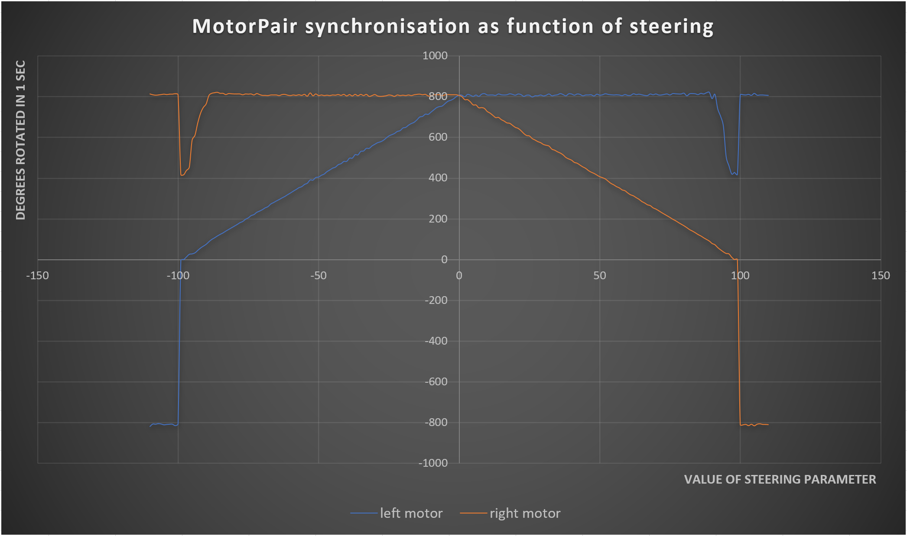
 
Looking at this graph I have the following obeservations
- It is symmetrical (positive versus negative steering) - that's good.
- Let's only look at positive steering 0..100 (steer to the right).
- The left wheel has constant speed (800) over nearly the full range (0 to ~90) - make sense.
- From ~90 to 99 there is a funny dip in the left motor speed - why?
- The right wheel has a linearly decreasing speed (800 to 0) over nearly the full range (0 to 99) - sounds good. 
- The only exception is steering at 100, where the motor speed suddenly is -800 - rotate on the spot exception.
- The range above 100 is equal to the case at 100 - clipping, makes sense.


## How can I set the 5x5 matrix in Python?
There is no easy way in Python to put an image in the 5x5 matrix, other then the list of standard ones.
There is the `hub.light_matrix.set_pixel(x,y,bright)` API, setting one pixel at a time.
I made my own helper.

```python
# Lights up 5x5 matrix.
# Parameter `bits` is a 25 bits vector: a 1 switches on that led.
# Bit 24 is upper left, bit 0 is lower right.
def set_image(bits):
    hub.light_matrix.off()
    cur=1<<24
    for y in range(5):
        for x in range(5):
            if bits & cur : hub.light_matrix.set_pixel(x,y,100)
            cur >>= 1

set_image( 0b_01110_00000_00100_00000_00000 )
```

todo: show result


## Why is there a wait-until helper in Python?


## How can I do parallel tasks in Python?


## How do I add an extension?

(end)
