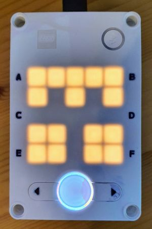
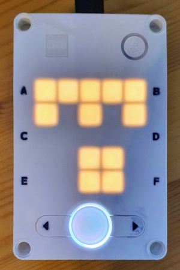
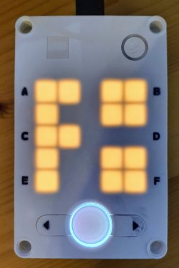

# Import from slot

Reusing one python program in another.

## Introduction

I read this interesting [post](https://www.facebook.com/story.php?story_fbid=538084377549405&id=100461371311710).

How does this work?

If you write a python program in the Lego IDE, and you upload and/or run it, it gets stored in a so-called slot.
What this means in practice is that the IDE generates a random id xxx, 
and saves your (pre-compiled) Python file under `/projects/xxx/__init__.mpy`.
It also updates the "index". This a a text file `/projects/.slots` with 20 entries (the slots).

As you might know, you can make one Python file `mmm.py` with "library" functions 
and then use those functions in another Python file via an `import mmm`.

The question the facebook post answer is:
can we import a slotted Python file into another slotted Python file?
Yes, that is what the post is about.

## Setup

We will write a library in slot 2 and a main program in slot 1.

### Library slot2module

First we write our library, unimaginatively called `slot2module`.
Open up the Lego IDE, create a Python module, paste the below code, and save it (e.g. under `slot2module`).

Here is the [py source](slot2module.py) or [lms source](slot2module.lms).

```python
# slot2module - Put this is slot 2
import hub, time

def beep(count=1) :
    for _ in range(count) :
        hub.sound.beep(freq=1000,time=25)
        time.sleep_ms(100)

def f2():
    print("running f2")
    hub.display.show( hub.Image("99099:90099:99000:90099:90099") )
    beep(2)

print("loaded slot2module")
hub.display.show( hub.Image("99999:90909:00000:99099:99099") )
beep(2)
time.sleep_ms(1000)
```

Run the module from **slot 2**. That is very important, because the "2" is what our main program will use later.

If you run this program, you should see

```text
loaded slot2module
```

hear _two_ beeps, and see an "m with two dots" on the hub display.



This module publishes the function `f2()` that we will use in the main program. 

### Main program slot1module

The main program is very similar to the library. In this case, save as `slot1module` and run it from **slot 1** 
(does not really matter, as long as it is not slot 2).

Here is the [py source](slot1module.py) or [lms source](slot1module.lms).

```python
# slot1module - Put this is slot 1
import hub, time, sys, util

def beep(count=1) :
    for _ in range(count) :
        hub.sound.beep(freq=1000,time=25)
        time.sleep_ms(100)

def import_from_slot(slot) :
    # sys.path is typically ['', '_slash_lib']
    # add /projects, this is persistent until hub is rebooted
    if '/projects' not in sys.path :
        sys.path.append('/projects')
    # Now import the module
    path = util.storage.get_path(slot) # './projects/40117'
    names = path.split('/') # ['.','projects','40117']
    name = names[-1] # '40117'
    return __import__(name)

print("loaded slot1module")
hub.display.show( hub.Image("99999:90909:00000:00990:009900") )
beep(1)
time.sleep_ms(1000)

m = import_from_slot(2)

m.f2()
```

This is the output


```text
loaded slot1module
loaded slot2module
running f2
```

We see `loaded slot1module`, hear one beep, and see an "m with one dot" on the hub display.
After one second, we see `loaded slot2module`, hear two beep, and see an "m with two dots" on the hub display.
Again one second later, we see `running f2`, hear two beeps, and see an "f with two dots" on the hub display.

  

### Conclusion

We see that `slot1module` indeed loads `slot2module` and is able to call `f2`.
The loaded module is identified by the slot number in `import_from_slot()`.
Also note that `import_from_slot()` returns a handle to the module, which must be used to find `f2()`.


## Save file

An experiment that seems feasible, is that a python scripts saves a python script to the file system
(or must that be a mpy file - or can we create an mpy file on the PC)?

And another Python script imports that.

To do...

(end)

