# Radar car

## Introduction

This car has a "radar" (ultrasonic distance sensor).
It drives straight, until it sees an obstacle close by.
Then it stops driving, it uses it sensor to see if either left or right has the most free space.
It makes a turn that way, and continues to drive straight again.

There is one more peculiarity: this car only makes "exact" 90 degree turns (using the built-in yaw sensor).
When driving straight, it also uses the yaw sensor to keep it direction.

Here is a [short video](https://youtu.be/--oO_Eg1EDk) with a close-up of the car.

Here is a [long video](https://youtu.be/2BKyWezTPEI) with a top-view of the driving area.

## Steps

**Step 01** Mount brackets on radar motor, ...
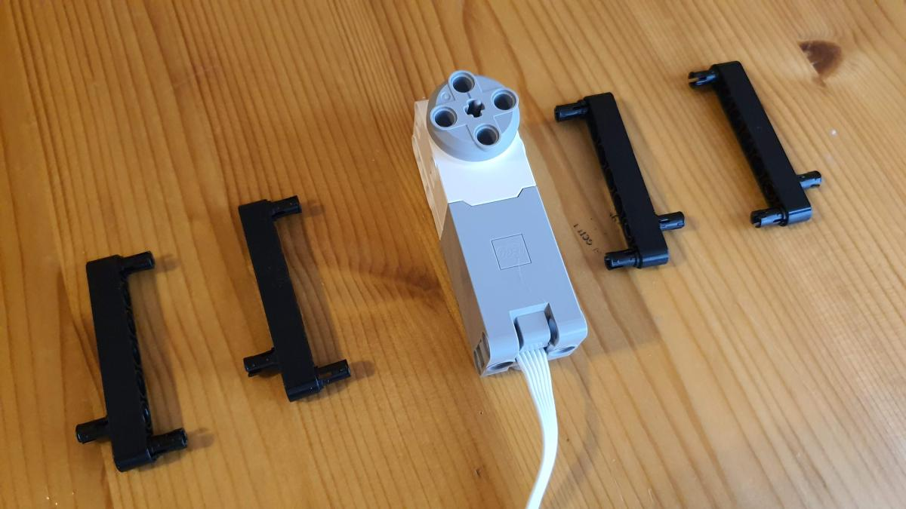

**Step 02** ... add drive motors ...
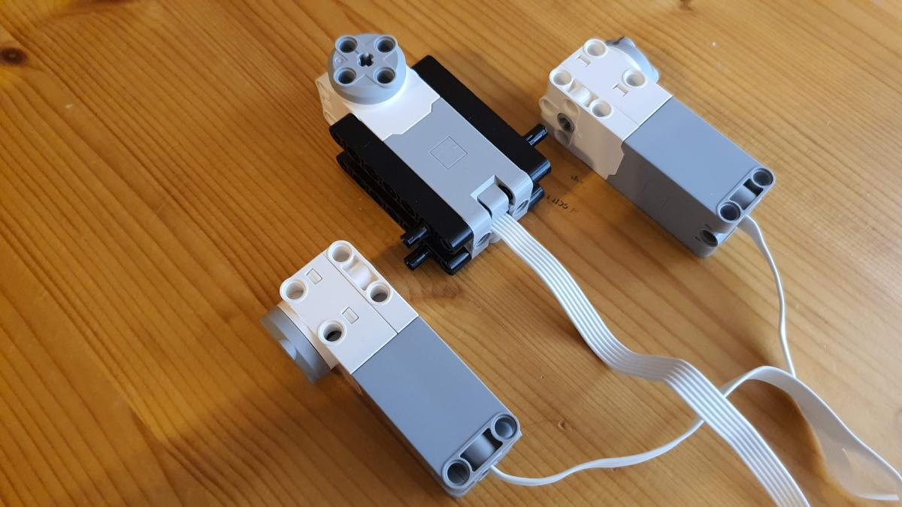

**Step 03** and add the wheels.
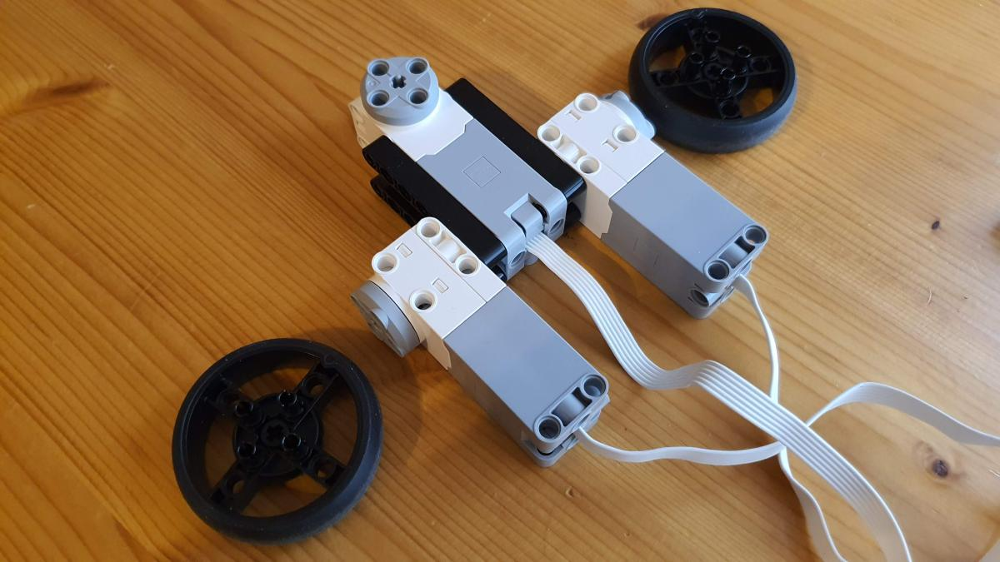

**Step 04** Put pegs in the hub ...
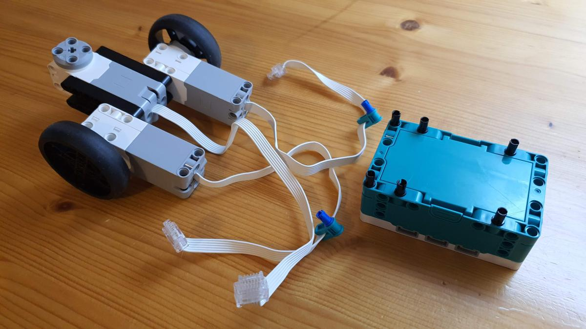

**Step 05** and mount the hub on top of the motors.
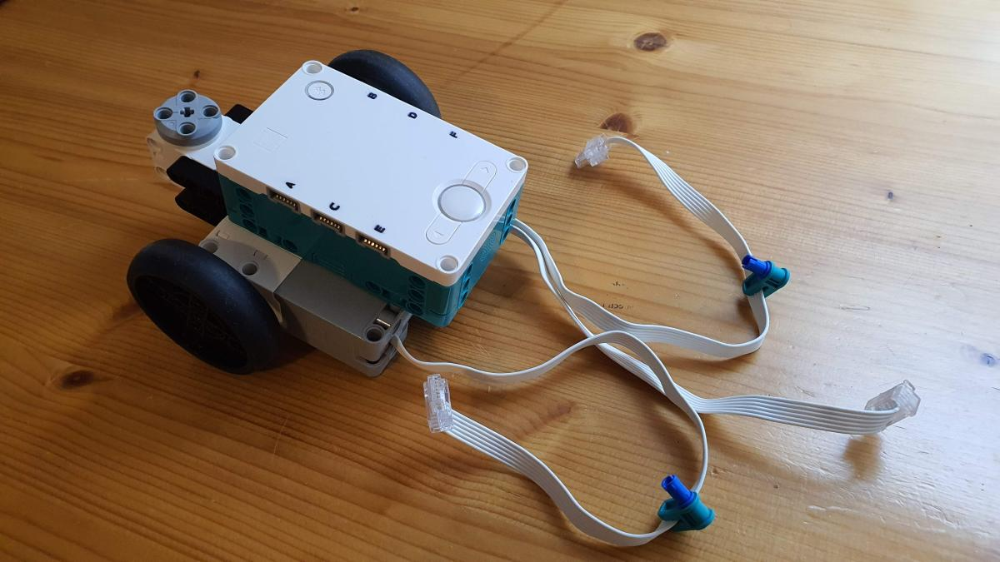

**Step 06** Turn the car up side down ...
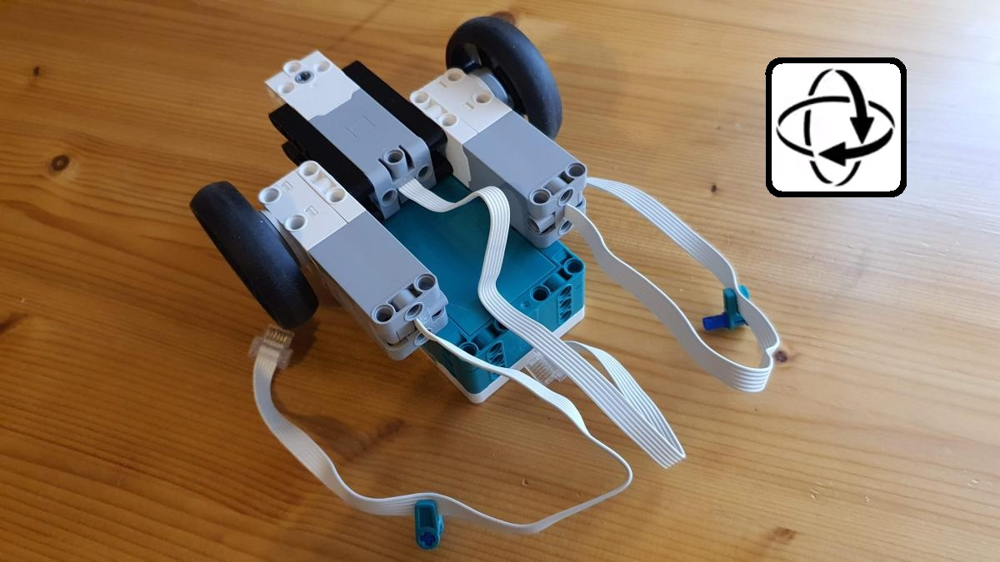

**Step 07** ... and tidy the cables using the clip (left drive motor in A, right drive motor in B, radar motor in C) ...
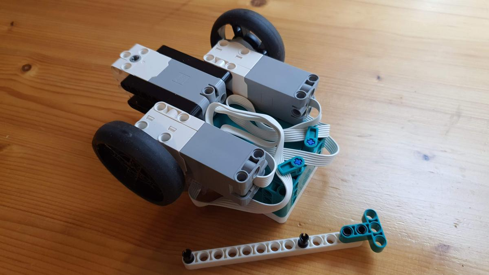

**Step 08** ... optionally using a beam to secure the cables.
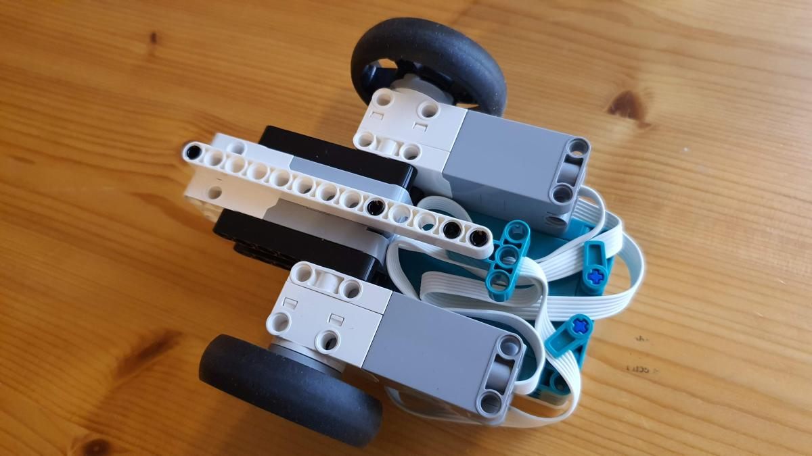

**Step 09** A sub assembly for the castor wheel

**Step 10** ... assembled ...
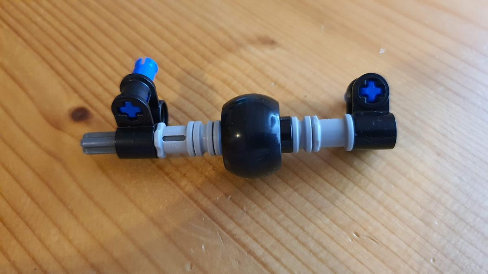

**Step 11** and mounted at the bottom.
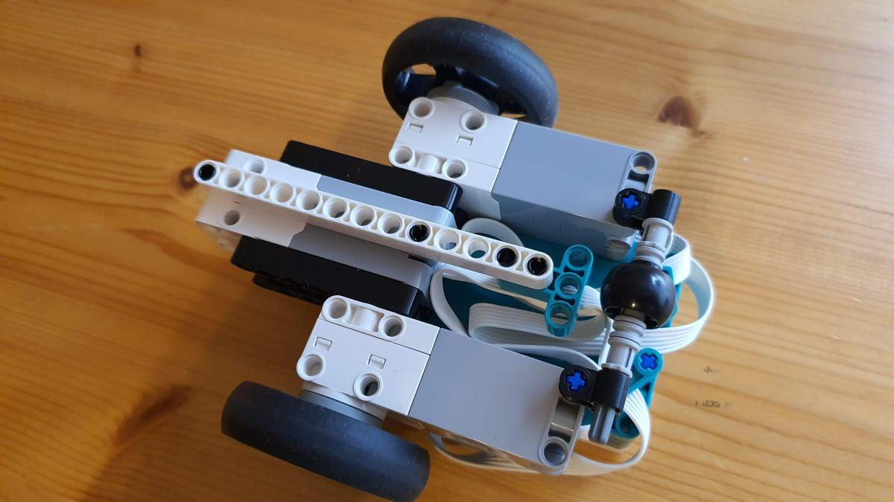

**Step 12** Turn the car upside again for the radar motor. It needs to be in zero position.
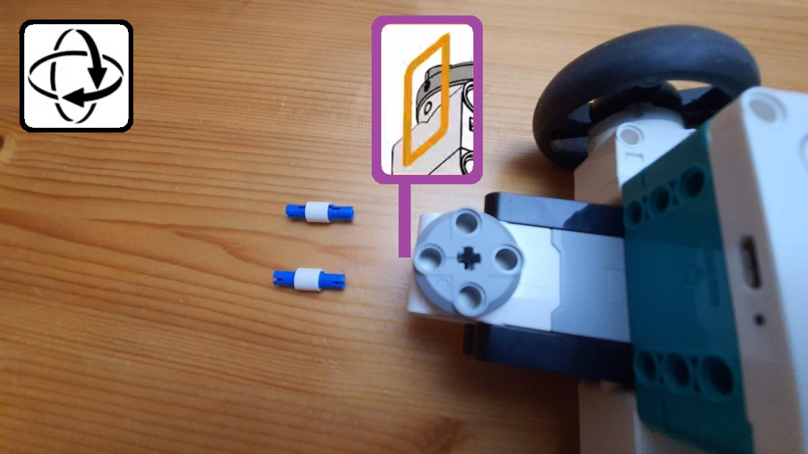

**Step 13** Brackets for the sensor ...
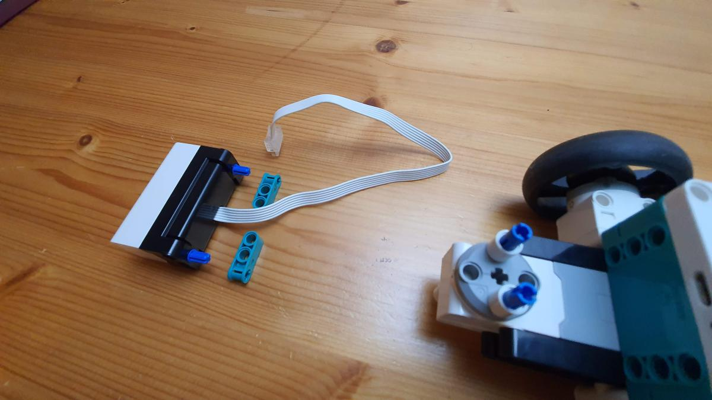

**Step 14** ... and mounted on the motor (cable in port F).
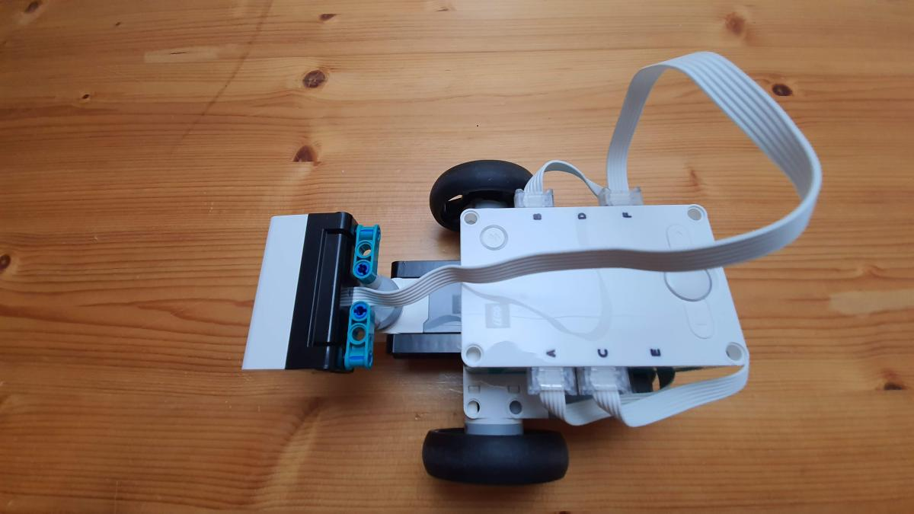

**Step 15** Finished result.
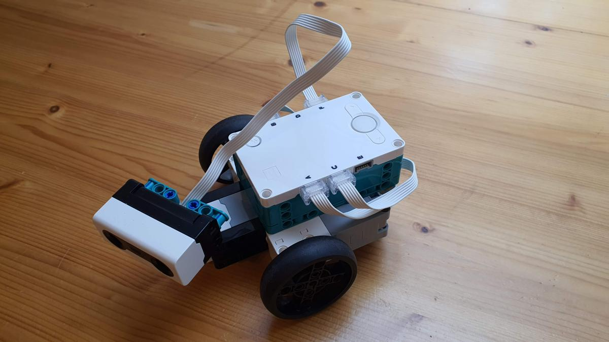

## Software

In the directory [prog](prog) you find the [file](prog/radarcar.lms) that you can open in the mindstorms app.

This program is writte in Python. For the reader's convenience I have included the [Python source](prog/radarcar.py). I hope to keep them in sync!

(end)
