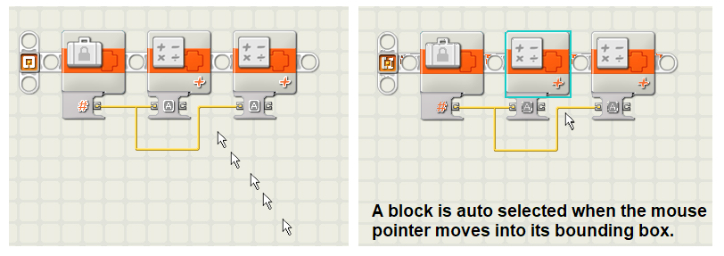
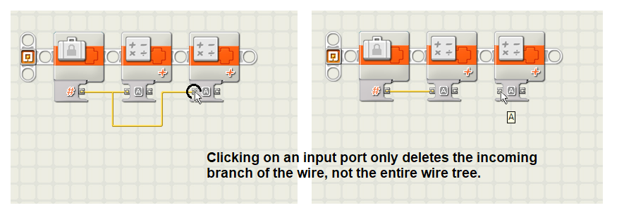

# Lego NXT IDE

Hints, tips, and tricks for the IDE (integrated development environment) of LEGO NXT Mindstorms robotics system.

## Introduction

NXT-G is the IDE (integrated development environment) that comes with Lego Mindstorms NXT.
It does have its quirks; this document has some tips.

## Tips

First tip: ctrl-drag to duplicate a block.

A not so convenient feature: blocks are auto selected.

Autoselection of blocks makes selecting wires harder. Tip: double click the wire.

If a wire is selected, a press on the DELETE key deletes the whole tree. Tip: click the input port to delete just the branch.

Want to make some space on the beam? Just drag a technic pin. If you hoover too long before clicking, it _branches_ the beam instead of making place (see next tip). Dragging also works to _remove_ space.

Branching a beam, is not intuitive. First hoover over the branch point until it "highlights" (very subtle). Then drag towards a new block that you placed before.

## Hotkeys

Some hotkeys:
- 1, 2, 3: selects the "common palette", the "complete palette" and the "custom palette".
- ArrowLeft, ArrowRight, ArrowUp, ArrowDown, PgUp, PgDn, home, end: pans the "paper" (workarea).
- Holding CTRL and SHIFT down, the mouse changes into a hand; it grabs the "paper" for panning.
- ^B to build/compile (?).
- ^D to (build and) download.
- ^R to (build, download and) run.
- ^I selects NXT window.

(end)
