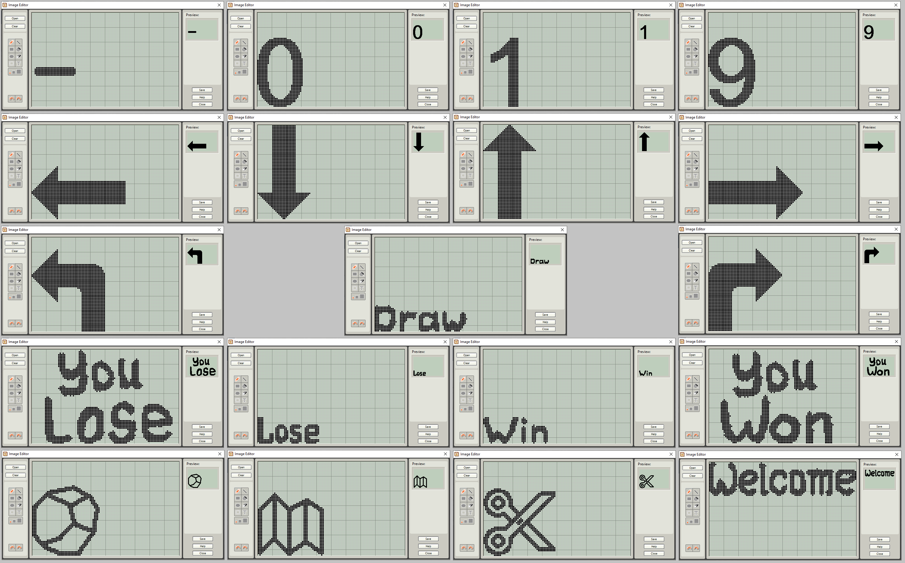

# Lego NXT Installation

Hints, tips, and tricks to install LEGO NXT Mindstorms robotics system 15 years after it got released.

## Software versions

My NXT brick (Settings > NXT Version) reports
- FW 1.31
- AVR 1.01
- BC4 1.01
- BUILD 1903101214

My NXT-G IDE reports
- v2.0.f4

See [lego](https://www.lego.com/en-us/themes/mindstorms/downloads) for the latest 
- [firmware](https://www.lego.com/cdn/cs/set/assets/blt3502cca1438605b8/Firmware131_Download1.zip)
  or local [copy](bins/Firmware131_Download1.zip).
- the [IDE](https://www.lego.com/assets/franchisesites/mindstorms/mac-window-installers/nxt-g-installer-v2.0f6-windows.zip#nourlrewrite).
- or the [USB driver](https://www.lego.com/cdn/cs/set/assets/bltea140e66e32fadf0/NXT_Fantom_Drivers_v120.zip)
  or local [copy](bins/NXT_Fantom_Drivers_v120.zip).

## NEXT-G IDE install on WIN10
On one Windows 10 PC, I downloaded the IDE from Lego and installed it. No problems.
But on another Windows 10 PC it did not install.

I found a [work around](https://www.reddit.com/r/mindstorms/comments/fn2vdh/fix_nxtg_software_on_x64_windows_10/):
- Download the last version (v2.0f6) of the software from the lego mindstorms website.
- Unzip the archive
- Copy [this batch file](install.bat) inside the base folder, where "setup.exe" is located
- Run this batch

## Extra pictures

In [engine_pictures](engine_pictures) you find some big arrows and big digits to copy to the pictures directory of your NXT installation. Here is an overview.

On my machine these directories need to be copied here `C:\Program Files (x86)\LEGO Software\LEGO MINDSTORMS NXT\engine\Pictures`.

## Resetting the NXT

If the running icon stops spinning, the NXT has frozen and you must reset it. Follow these steps to reset the NXT:
1. Make sure that the NXT is turned on.
2. Press the reset button that is located on the back of your NXT in the Technic hole in the upper left corner. 
3. If you press the reset button for more than 4 seconds, you will need to update the firmware.

## Clicking brick

The NXT firmware has either been deleted or is corrupty. But the brick and its bootloader is still working.
See [here](http://www.legoengineering.com/clicking-brick-syndrome/) for details.

In some cases you have a driver problem.
1. Open device manager and find under `Ports (COM & LPT)` the `Bossa Program Port` driver and select `Update driver`.
2. Via `Browse my computer for driver software` then `Let me pick from a list...` find `LEGO MINDSTORMS NXT` driver instead. 
3. Then it is possible to connect to the NXT and update firmware.

Found this tip [here](https://home.et.utwente.nl/slootenvanf/2016/04/15/lego-firmware/). Here is a procedure from [Lego service desk](https://bricks.stackexchange.com/questions/2624/nxt-brick-will-not-update-firmware).

(end)
