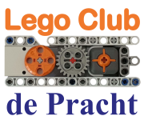

# Lego club De Pracht

## Exercises Lego Club de Pracht
I run a Lego club in the village, were 8-12 year old children make robots using Lego Mindstorms NXT.
The exercises [pdf](LegoClub.pdf) or [word](LegoClub.docx) are in Dutch only.

## Primary school tech-week
I sometimes get invited by a local primary school during the tech-week. 
I then have a one-morning session building robots with NXT (check out the [pdf](KennisMakingNXT.pdf) or [word](KennisMakingNXT.docx) file)
but also the school's EV3 sets (adapted [pdf](KennisMakingEV3.pdf) or [word](KennisMakingEV3.docx)).

(end)
