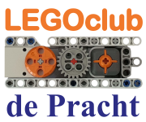

# LEGOclub de Pracht
I run a club in the village, were 8-12 year old children make robots using LEGO Mindstorms NXT.

## Logo
The club has a new logo, showing technic beams (reference to LEGO technic), 
a gear (reference to machines/robots), a motor (actuator) and button (sensor).
See [logo](logo) for multiple sizes.

## Exercises LEGOclub de Pracht
The exercises are in Dutch only: [pdf](LegoClub.pdf) or [word](LegoClub.docx).

## Videos
Each time a LEGO robot is finished we put it on YouTube playlist 
[Maarten Pennings - LEGOclub](http://www.youtube.com/playlist?list=PLrlJSwck1Q0iv_t6WtuNv7dbaEXJX42nd).

Unfortunately, Google made YouTube less friendly for kid's channels, so we created a new one 
[LEGOclub de Pracht](https://www.youtube.com/channel/UCxKt3LKH9oVT_rLr5mPyQkg).

## Primary school tech-week
We sometimes get invited by a local primary school during their _tech-week_. 
We then have a one-morning session building robots with NXT (check out the [pdf](KennisMakingNXT.pdf) or [word](KennisMakingNXT.docx) file)
but also the school's EV3 sets (adapted [pdf](KennisMakingEV3.pdf) or [word](KennisMakingEV3.docx)).

## Laptop for the club
The Mindstorms NXT is from 2006 the same year that Windows Vista was released.
In practice the means that the LEGO software runs on Windows XP.
Since the club is short on money, we typically don't buy laptops for the club
but try to get oldies for free.

These are the steps we take to prepare an old laptop for the club

### Step 1 - Wipe the laptop by installing windows XP.

We still have an XP (service pack 3) CD but laptops do not always come with a CD player build in.
We do have a CD brick for desktops and sometime use an IDE to USB bridge
to hook up the CD to the laptop. An alternative is to use a bootable
USB stick (made with [rufus](https://rufus.ie/en/)), but not all (old) laptops
allow booting from USB.

Alternatives are to use the Vista, Windows 7, 10 or 11.
However, for newer Windows 10 (and presumably 11) the NXT IDE
is harder to install. 

Extra steps we take
- Disable several BIOS features:
  COM port, parallel port, ethernet adapter, wifi

- Install device drivers (XP doesn't do that by itself)
  sound output, microphone (programs/accessoires/sound recorder), bluetooth, video card

- Small configs:
  - system to high performance (simple UI)
    Except: System Properties|tab Advanced|panel Performance then click button Settings
    In tab Visual Effects put a check for 'Use drop shadows for icon labels on desktop'
  - explorer: detailed view; do not hide extensions; for all folders
  - in tray: disable virus scanning
  - start menu: classic; delete start menu app, delete most apps in start/programs
  - video card in highest resolution
  - delete My Pictures and My Music
  - remove all shortcuts from desktop (except recycle bin, lego)
  - create desktop shortcut to MyDocuments

- We label all laptops in the club, so that next week the children get the same
  laptop with the program as the left off last week.
   - Legoclub (as name)
   - De Pracht (as company)
   - Legoclub[123456] (as computer name)
   - Legoclub (as admin password)
   - Legoclub [123456] (as username - note the space)
   - Wall paper with correct resolution and label, see [this repo](labels/man-6-extendedbottom-calibri150-1366x768.jpg)

### Step 2 - Install mindstorms IDE
See [elsewhere in this repo](../install/install.md) for details.
For older Windows (XP, Vista, Windows 7) that works fine,
for the newer see the [install on Win 10](../install/install.md#next-g-ide-install-on-win10)
section for a possible workaround.

We typically add shortcuts to the NXT-G IDE on the desktop, start menu, 
and we add it to startup folder.

- create shortcut on the Desktop to the projects directory.
  - Win XP: `C:\Documents and Settings\Legoclub 3\My Documents\LEGO Creations\MINDSTORMS Projects\Profiles\Default`
  - Win 7: `C:\Users\maarten\Documents\LEGO Creations\MINDSTORMS Projects\Profiles\Default`
- Add extra pictures (for -, digits, and arrows) from [elsewhere](../install/install.md#extra-pictures) in this repo.
  - Win XP: `C:\Program Files\LEGO Software\LEGO MINDSTORMS NXT\engine\Pictures`
  - Win 7: `C:\Program Files (x86)\LEGO Software\LEGO MINDSTORMS NXT\engine\Pictures`
- Add integer arithmatic block, see [elsewhere](../nxt/blocks/blocks.md#integer-math) in this repo.
  - Win XP: `C:\Program Files\LEGO Software\LEGO MINDSTORMS NXT\engine\EditorVIs\BlockRegistry\Data\Numeric Operations.txt`
  - Win 7: `C:\Program Files (x86)\LEGO Software\LEGO MINDSTORMS NXT\engine\EditorVIs\BlockRegistry\Data\Numeric Operations.txt`
- Disable warning in Help (pressing F1 in IDE pops up IE with warning)
  In IE go to `Tools|Internet Options|tab Advanced|section Security`, check `Allow active content...`.
      
### Step 3 - Stickering      
We label all laptops in the club, so that next week the children get the same
laptop with the program as the left off last week.
Example stickers for [1-5](labels/stickers12345-calibri-275.png) or [6-10](labels/stickers67890-calibri-bold-275.png) 
are in this repo.
- Put sticker with [123456] on laptop cover
- Put sticker with [123456] on laptop keyboard 
- Put sticker with [123456] on laptop power supply

### Step 4 - Final test
Test if NXT sw is working and if NXT driver is there.
Optionally test the Bluetooth connection.

(end)
