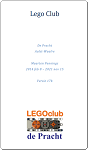

# LEGOclub de Pracht

         

## Exercises LEGOclub de Pracht
I run a club in the village, were 8-12 year old children make robots using LEGO Mindstorms NXT.
The exercises are in Dutch only: [pdf](LegoClub.pdf) or [word](LegoClub.docx).

## Videos
Each time a LEGO robot is finished I put it on YouTube playlist 
[Maarten Pennings - LEGO club](http://www.youtube.com/playlist?list=PLrlJSwck1Q0iv_t6WtuNv7dbaEXJX42nd).

Unfortunately, Google made YouTube less friendly for kid's channels, so I created a new one 
[De Pracht LEGO club](https://www.youtube.com/channel/UCxKt3LKH9oVT_rLr5mPyQkg).

## Primary school tech-week
I sometimes get invited by a local primary school during their _tech-week_. 
I then have a one-morning session building robots with NXT (check out the [pdf](KennisMakingNXT.pdf) or [word](KennisMakingNXT.docx) file)
but also the school's EV3 sets (adapted [pdf](KennisMakingEV3.pdf) or [word](KennisMakingEV3.docx)).

(end)
