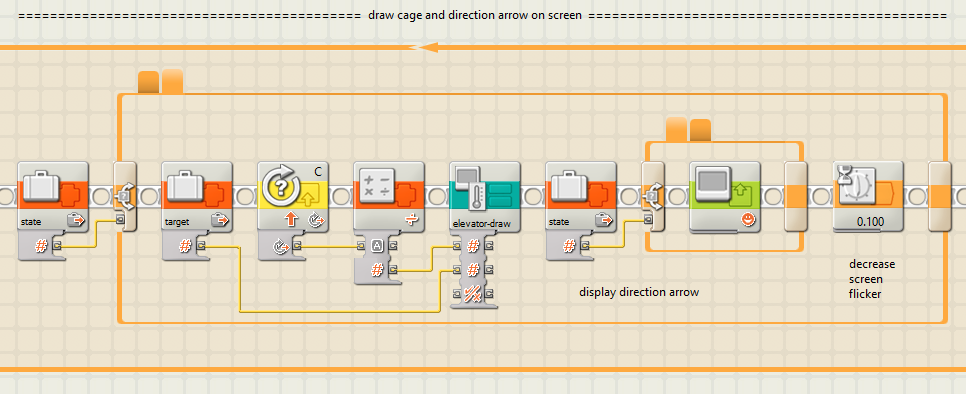

# Elevator

This document describes a LEGO Mindstorms NXT elevator.

## Introduction

To build the elevator, more LEGO parts are needed than are part of the NXT set.

Some key components that are needed:
- One NXT [brick](https://www.bricklink.com/v2/catalog/catalogitem.page?S=9841-1)
- One NXT [servo motor](https://www.bricklink.com/v2/catalog/catalogitem.page?S=9842-1)
- Four NXT [buttons](https://www.bricklink.com/v2/catalog/catalogitem.page?P=53793)
- Five long NXT [cables](https://www.bricklink.com/v2/catalog/catalogitem.page?S=5003305-1)
- Ten [1x4 gear racks](https://www.bricklink.com/v2/catalog/catalogitem.page?P=3743)

Key features of the elevator
- Four floors.
- Four buttons (1..4), pressing button _i_ moves the elevator cage to floor _i_.
- Display shows current floor number.
- Soll-ist control: at any moment a button can be pressed, and immediately the cage starts moving to that floor, even mid movement.
- Animation on the display, showing the moving cage, while it is moving.

## Install

The software consists of sub-routines ("My Blocks"), and some sub-routines display images.

To install the elevator software on your PC, so that you can compile and upload it,
the following files need to be installed.

> Note: the elevator application uses floating point computations, so install a new NXT IDE 2.0.

### Images

The sub-routine `show-digit` shows big digits on the display.
For this is needs 11 images: digits 0 to 9 and - (for out-of-range numbers).
See for example the big `2` in the below photo of the NXT screen.

The sub-routine `elevator-draw` draws the elevator.
See the left hand side in the above photo of the NXT screen.
The elevator consists of three parts, the shaft, the cage, and an arrow (indicating the target floor).
The cage is drawn (using lines), but the shaft and arrow are images.

All 11 files need to be copied from [pictures](pictures) subdirectory
to the development PC. In my case to directory:

`C:\Program Files (x86)\LEGO Software\LEGO MINDSTORMS NXT\engine\Pictures`.

### Sub-routines

The elevator application uses several sub-routines.
- `show-digit.rbt` draws a big digit on the display.
- `elevator-draw.rbt` draws the elevator (shaft, cage, target arrow) on the display.
- `run-to-stop.rbt` switches the cage motor on until it cannot move further 
  (when it hits a stop), then switches it off.
- `read-button.rbt` assumes all 4 sensor ports have a button, polls all of them and 
  returns the index of pressed button.
- `delta-from-target.rbt` reads angle sensor of motor, subtracts target degrees, 
  and returns the sign of the difference (tells required direction of motor).

All 5 files need to be copied from [myblocks](myblocks) subdirectory
to the development PC. In my case to directory:

`C:\Users\maarten\Documents\LEGO Creations\MINDSTORMS Projects\Profiles\Default\Blocks\My Blocks`.

### Tests

Some of the Sub-routines are relatively independent of the project.
For these there is a test application.

- [`test-elevator-draw.rbt`](apps/test-elevator-draw.rbt)
- [`test-read-button.rbt`](apps/test-read-button.rbt)
- [`test-show-digit.rbt`](apps/test-show-digit.rbt)

You may copy these to your projects directory, in my case:

`C:\Users\maarten\Documents\LEGO Creations\MINDSTORMS Projects\Profiles\Default`

### Application

The actual application is [`elevator.rbt`](apps/elevator.rbt).
You must copy this to your projects directory, in my case:

`C:\Users\maarten\Documents\LEGO Creations\MINDSTORMS Projects\Profiles\Default`

Note that the application uses variable. 
I assume they are part of the `elevator.rbt` project.
But if you make your own make sure to have them declared.

A spacial case is the elevator project specific sub-routine `delta-from-target.rbt`,
this routines reads two global variables (`target` and `delta`).
Similarly, the `read-button.rbt` sub-routine uses the `button` variable.

## Documentation

### Sub-routine run-to-stop

The sub-routine `run-to-stop` switches a motor (the cage motor) on until it cannot 
move further. Then it reverses a bit and stops.

The input `Port` is used to supply the motor to control (in our case the cahe motor).

The input `Direction` indicates what direction to rotate towards the stop.

We see that the first block switches motor `Port` on in `Direction`.
The next block is a loop; it reads rotation sensor from motor `Port` twice (with 100ms wait in between).
If both are equal the motor is no longer able to move, and the loop stops.
Next the motor is stopped (maybe not needed), and then `Direction` is reversed, 
and the motor backs up for `Duration` degrees (the third input parameter).

### Sub-routine elevator-draw

The sub-routine `elevator-draw` draws the elevator. It first draws the shaft, 
next the target arrow, and finally the cage.

The shaft is drawn at position (0,0) (lower left corner), with the screen `clear` flag as input.
The shaft is 20 pixels wide, each floor is 15 high, so the complete shaft is 60 pixels high.

The second input `target-floor` is an integer 1, 2, 3 or 4. It indicates were to draw the arrow.
The arrow shows the last pushed button ("target floor"). The x position of the arrow is fixed (22),
and the y is computed by multiplying by `target-floor` by 15 (the floor height) and adding an 
offset (-12), negative because the `target-floor` is 1 based.

The third input `cage-float` is an floating point value from including 0 to excluding 4.
Note the inconsistency: `target-floor` is 1 based and integer, whereas `cage-float` is 0-based,
and float. This happens to best fit the application. 

The cage horizontal position is fixed: x-coordinates 4 and 15. But the y-coordinates
are computed from `cage-float`. First the multiplication with the floor height (15),
then an offset for the botton (0.5 to round) and finally and offset for the top 
(13, two pixels less than the floor height). The y-coordinates are used to draw 4 lines.
That concludes the sub-routine.

### Sub-routine show-digit

The sub-routine `show-digit` draws a big digit on the display.
It consist of a single big 11-way switch.

The switch is controlled by the input `digit`. This is supposed to have a value 
0, 1, 2, 3, 4, 5, 6, 7, 8, or 9. The 10-case is the default, it will display as `-`.

The second input, `clear`, determines whetehr the display block clears the screen.

The digit is drawn at localtion determined by inputs `x` and `y`.

### Sub-routine read-button

The sub-routine `read-button` assumes all 4 sensor ports have a button.
It polls all of them and returns the index of pressed button.

The inplementation trick that is used, is to use a variable `button`, 
which is written with the port index (that is, 1, 2, 3, or 4), 
if the button on that port is pressed.
At the end, the variable is returned.

The initial value of the button is typically 0, but can be passed by the caller
as input `default`.

This sub-routine requires the declaration of the variable `button`.

### Sub-routine delta-from-target

The sub-routine `delta-from-target` is application specific.
Its purpose is to compute the difference between "soll" 
(the target position indicated by the last button press)
and the "ist" (the current position of the cage).

That difference is referred to as `delta`, but more important is
the `sign` of `delta`, it indicates if the target is below or above the current position.
In other words, it indicates if the motor must turn upward or downward.

There is one input parameter `port` to pass the port of the cage motor.
There are two outputs, the computed soll-ist `delta` and its `sign`.

However, this sub-routine has a hidden input: the target floor is obtained
via global variable `target`. 

This sub-routine requires the declaration of the variable `target` and a variable `delta`.

The first block obtains "ist", the current cage position in degrees by reading the sensor
of the motor on the passed `Port`. 

The next block obtains "soll", the requested target position, by reading that from the 
global variable. The target floor position is converted to degrees, by first subtracting 1,
and then by multiplying it by -621. The cahe motor must rotate 621 degrees to get to the next
floor, and upwards happens to be negative direction for the cage motor.

Atter that the soll and ist are subtraced and stored in `delta`.
The two `if` blocks that follow compute the `sign` (-1, 0 or +1) of `delta`.

This is a bit tricky: every (nested) then/else must output the same yellow line (to `sign`).

### Application elevator

The application consists of 4 parts.

#### Part 1 initialization

The first part is the initialization. It prints a banner (in three blocks: "De Pracht", 
"LEGO club", and "== ELEVATOR =="). Then homes the cage motor, bringing it to the ground 
floor, floor 1, (which has a stop). Next we set the target to that floor number (1), so that
the elevator idles after init. Next the global variable `state` is set (see below).
The user gets three pieces of feedback: a drawing of the elevator (with the cage drawn
at the just reached floor 1, and the target arrow set at floor 1), a big digit of the
floor where the cage has halted, and a audible nitification. The init part end by resetting
the cage motor rotation sensor to 0 (it is at the ground floor).

The `state` records the state of the system: 0 means that the cage is not moving; it is 
at the target floor. A -1 means that the cage is moving up; we have chosen -1 since negative
motor degrees means the motor is moving the cage up. Likewise, a +1 means the cage is moving down.

#### Part 2 new target: switch motor on

#### Part 3 update GUI

#### Part 4 target reached: stop motor`

(end)

