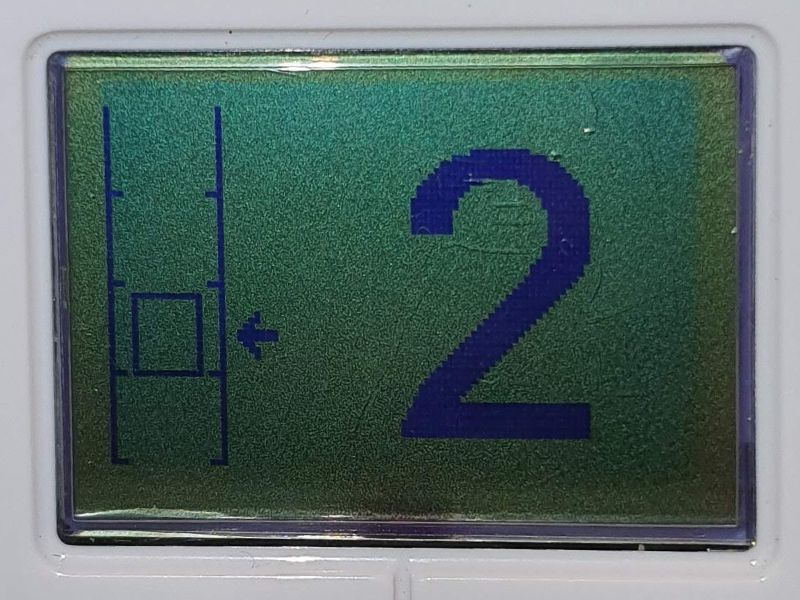
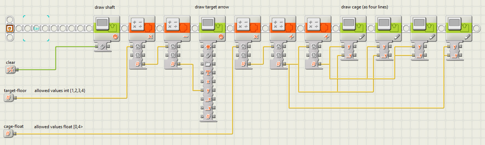
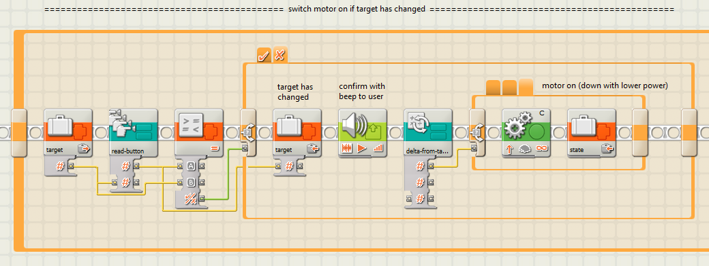

# Elevator

This document describes a LEGO Mindstorms NXT four-floor elevator.
It focuses on software. 

Click below image for a video.
[🎥](https://www.youtube.com/shorts/1_JTvgue5f0)

## Introduction

To build the elevator, more LEGO parts are needed than are part of the NXT set.

Some key components that are needed:
- One NXT [brick](https://www.bricklink.com/v2/catalog/catalogitem.page?S=9841-1).
- One NXT [servo motor](https://www.bricklink.com/v2/catalog/catalogitem.page?S=9842-1).
- Four NXT [buttons](https://www.bricklink.com/v2/catalog/catalogitem.page?P=53793).
- Five long NXT [cables](https://www.bricklink.com/v2/catalog/catalogitem.page?S=5003305-1).
- Ten [1x4 gear racks](https://www.bricklink.com/v2/catalog/catalogitem.page?P=3743).

Key features of the elevator
- Four floors.
- Four buttons (1..4), pressing button _n_ moves the elevator cage to floor _n_.
- NXT display shows current floor number.
- Soll-ist control: at any moment a button can be pressed, and immediately the cage 
  starts moving to that floor, even mid movement of the previous press.
- Animation on the display, showing a moving cage, while the real cage is moving.

## Install

The software consists of sub-routines ("My Blocks"), and some sub-routines display images.

To install the elevator software on your PC, so that you can compile and upload it,
several files need to be installed on your PC. This chapter explains which ones, and what
the accomplish.

> Note: the elevator application uses floating point computations, so install the new NXT IDE 2.0.

### Images

The sub-routine `show-digit` shows big digits on the display.
For this it needs 11 images: digits `0` to `9` and `-` (for out-of-range numbers).
See for example the big `2` in the below photo of the NXT screen.

The sub-routine `elevator-draw` draws the elevator.
See the left hand side in the above photo of the NXT screen.
The elevator consists of three parts: the shaft, the cage, and an arrow (indicating the target floor).
The cage is drawn (using lines), but the shaft and arrow are images.

Finally, the main program draws an up or down arrow to show the direction of the cage.
It also draws a spash screen at the start.

All 11+2+3 or 16 image files need to be copied from the [pictures](pictures) sub-directory
to the development PC:

`C:\Program Files (x86)\LEGO Software\LEGO MINDSTORMS NXT\engine\Pictures`.

### Sub-routines

The elevator application uses several sub-routines.
- `show-digit.rbt` draws a big digit on the display.
- `elevator-draw.rbt` draws the elevator (shaft, cage, target arrow) on the display.
- `run-to-stop.rbt` switches the cage motor on until it cannot move further 
  (when it hits a stop), then switches it off.
- `read-button.rbt` assumes all 4 sensor ports have a button, polls all of them and 
  returns the index of pressed button (if any).
- `delta-from-target.rbt` reads the angle sensor of the cage motor, subtracts 
  target degrees, and returns the sign of the difference 
  (tells required direction of motor to mive towards target floor).

All 5 files need to be copied from the [myblocks](myblocks) sub-directory
to the development PC. In my ("maarten"s) case to directory:

`C:\Users\maarten\Documents\LEGO Creations\MINDSTORMS Projects\Profiles\Default\Blocks\My Blocks`.

### Tests

Some of the sub-routines are relatively independent of the project.
For these there is a test application.

- [`test-elevator-draw.rbt`](apps/test-elevator-draw.rbt)
- [`test-read-button.rbt`](apps/test-read-button.rbt)
- [`test-show-digit.rbt`](apps/test-show-digit.rbt)

You may copy these to your projects directory, in my ("maarten"s) case:

`C:\Users\maarten\Documents\LEGO Creations\MINDSTORMS Projects\Profiles\Default`

### Application

The actual application is [`elevator.rbt`](apps/elevator.rbt).
You must copy this to your projects directory, in my ("maarten"s) case:

`C:\Users\maarten\Documents\LEGO Creations\MINDSTORMS Projects\Profiles\Default`

Note that the application uses variables. 
I assume they are part of the `elevator.rbt` project.
But if you start your own project make sure to have them declared.

A special case is the elevator project specific sub-routine `delta-from-target.rbt`,
this routines needs two global variables (`target` and `delta`).
Similarly, the `read-button.rbt` sub-routine uses the `button` variable.

## Documentation

This chapter documents all sub-routines and the top-level application.

### Sub-routine run-to-stop

The sub-routine `run-to-stop` switches a motor (the cage motor) _on_ until it cannot 
move further. Then it reverses a bit and switches the motor _off_.

The input `Port` is used to indicate the motor to control (in our case the cage motor).

The input `Direction` indicates what direction to rotate the motor towards the stop.

We see that the first block switches motor `Port` on in `Direction`.
The next block is a loop; it reads the rotation sensor from motor `Port` twice 
(with 100ms wait in between). If both read-outs are equal the motor is no 
longer able to move, and the loop exits.
Next the motor is stopped (maybe not needed), and then `Direction` is reversed, 
and the motor backs up for `Duration` degrees (the third input parameter).
The backing up is needed to relieve the stress of the motor pushing the stop.

### Sub-routine elevator-draw

The sub-routine `elevator-draw` draws the elevator. It first draws the shaft, 
next the target arrow, and finally the cage.

The shaft is drawn at position (0,0), the lower left corner, with the screen `clear` 
flag as input. The shaft is 20 pixels wide, each floor is 15 pixels high, so the 
complete shaft is 60 pixels high.

The second input `target-floor` is an integer 1, 2, 3 or 4. It indicates were to draw the arrow.
The arrow shows the last pushed button (the "target floor"). The x position of the arrow is fixed (22),
and the y is computed by multiplying by `target-floor` by 15 (the floor height) and adding an 
offset (-12), negative because the `target-floor` is 1 based instead of 0 based.

The third input `cage-float` is an floating point value from including 0 to excluding 4.
Note the inconsistency: `target-floor` is integer and 1-based 
(since buttons and floors are numbered 1,2,3,4), whereas `cage-float` is float and 0-based
(since the cage is degrees with floor 1 being at degrees 0). 

The cage horizontal position is fixed: x-coordinates 4 and 15. But the y-coordinates
are computed from `cage-float`. First is the multiplication with the floor height (15),
then an offset for the bottom (0.5 to round) and finally and offset for the top 
(13, two pixels less than the floor height). The y-coordinates are used to draw 4 lines.
That concludes the sub-routine.

### Sub-routine show-digit

The sub-routine `show-digit` draws a big digit on the display.
It consist of a single 11-way switch. This is more than we need for the elevator
application (1-4 would suffice), but this makes the My Block reusable for other
applications.

The switch is controlled by the input `digit`. This is a number supposed to be one of  
0, 1, 2, 3, 4, 5, 6, 7, 8, or 9. The last case (with arbitrary value 10) is the default
of the switch, it will display as `-`.

The second input, `clear`, determines whether the display block clears the screen
before drawing the digit. The digit is drawn at location determined by inputs `x` and `y`.

### Sub-routine read-button

The sub-routine `read-button` assumes all 4 sensor ports have a button (touch sensor) plugged in.
It polls all of them and returns the index of pressed button.

The implementation trick, is to use a variable `button`, 
which is written with the port index (that is, 1, 2, 3, or 4), 
if the button on that port is pressed.
At the end, the variable `button` is returned by the sub-routine.

The initial value of variable `button` is typically 0, to detect that no button was pressed.
But this value can be passed by the caller as input `default`.

> This sub-routine requires the declaration of the variable `button`.

### Sub-routine delta-from-target

The sub-routine `delta-from-target` is application specific.
Its purpose is to compute the difference between "soll" 
(the target position indicated by the last button press)
and the "ist" (the current position of the cage).

That difference is referred to as `delta`, but more important is
the `sign` of `delta`, it indicates if the target is _below_ or _above_ the current position.
In other words, it indicates if the motor must turn _upward_ or _downward_.

There is one input parameter `port` to pass the port of the cage motor.
There are two outputs, the computed soll-ist `delta` and its `sign`.
However, this sub-routine has a hidden input: the target floor is obtained
via global variable `target`. 

> This sub-routine requires the declaration of the variable `target` and a variable `delta`.

The first block of the sub-routine obtains "ist", 
the current cage position, in degrees, by reading the sensor
of the motor on the passed `Port`. 

The next block obtains "soll", the requested target position, by reading that from the 
global variable `target`. The target floor position is converted to degrees, by 
first subtracting 1, and then by multiplying it by -621. The cage motor must 
rotate 621 degrees to get to the next
floor, and upwards happens to be negative direction for the cage motor.

After that, the soll and ist are subtracted and stored in `delta`.
The two `if` blocks that follow compute the `sign` (-1, 0 or +1) of `delta`.
The NXT syntax for a conditional value computation is a bit tricky: 
every (nested) then/else tab must output the same yellow line (to `sign`).

### Application elevator

The application consists of 4 parts. The first part is a one-time initialization.
Next comes an infinitely repeating loop with three parts. 

The behavior of the system is largely controlled by the `state` variable.
It records the state of the system (of the cage motor): 
- 0 means that the cage is _not moving_; it is at the target floor. 
- -1 means that the cage is _moving up_; we have chosen -1 since 
  moving the cage up, maps to negative motor degrees.
- +1 means the cage is _moving down_.

After initialization comes an infinite loop with three parts: 
- Button check and if a button is pressed switch on the cage motor.
  This step is always performed, irrespective of the value of `state`.
  If this step switches on the motor, that is reflected in `state`.
- Draw animation frame. Only performed when `state` indicates moving (is not 0).
- Check if motor reaches target, if so, switch of motor.
  Naturally, also this step is only performed when `state` indicates moving (is not 0).

#### Part 1 initialization

The first part of the application is the initialization. It starts by displaying a banner,
while (second block) it homes the motor. This brings the cage to the ground 
floor, floor 1, (which has a stop). Next, it sets the `target` to that floor number (1), so that
the elevator idles after initialization, and the global variable `state` is set to 0 
(cage not moving, see above).

After these preparations, the user gets three pieces of feedback: 
an audible notification, a drawing of the elevator 
(with the cage drawn at the just reached floor 1, and the target arrow set at floor 1), 
and a big digit of the floor where the cage has halted (again 1). 

The initialization part ends by resetting the cage motor rotation sensor to 0 
(it is at the ground floor). This is done last so that the cage motor has the time 
it takes for the audio fragment to play to come to rest.

#### Part 2 new target: switch motor on

After initialization, the infinite loop starts. The first part of the loop
is independent of `state`. It checks if any of the four buttons is pressed;
button `n` maps to (the new target) floor `n`.
Note that `read-button` is initialized with the current `target`.
This is a small trick to simplify the condition of the subsequent if-block: 
we do not have to update the `target` and `state` if the same button is pressed 
as the current `target` or if no button is pressed (with the default, 
that also returns current `target`).

If the newly pressed buttons differs from `target` the then-branch is executed
(the one shown in the picture above). The else-branch is empty.

In the then-branch, the new button value is stored in `target`.
User gets audible feedback that the new `target` is set.

The button gives the new target floor, but the cage motor could be moving from a previous target.
So with the help of sub-routine `delta-from-target` we compute the difference
between soll (target) and ist (current cage position). 

The switch that follows only looks at the sign of the difference.
The tab for when sign equals 0 is empty; the tabs for -1 and +1 are very similar, 
the tab of +1 is depicted in the above picture. Recall +1 is for down.
- The motor block switches the cage motor in downward direction
- The `state` is written with +1 to record the cage motor is going down.

#### Part 3 update GUI

The second part of the infinite loop draws an animation frame. 
It is only performed when `state` indicates moving.
When not moving, the screen is not refreshed.

This part therefore starts by reading `state`, and the following if-statement 
is empty for state equal to 0 (not moving).
The picture below shows the then tab taken for -1 and +1.

The tab for moving draws the elevator (shaft, cage, target arrow) 
based on the current target ("soll") and the current cage position ("ist").
The latter is derived from the angle sensor in the motor,
divided by the number of degrees between two floors (621).
Note that this makes the "soll" and integer 1,2,3,4 and "ist" 
a float from 0 to but excluding 4.

The next two blocks either draw an up or a down arrow
depending on `state` - the direction the cage is moving.

The GUI update part ends with a delay of 100ms.
This delay reduces display flicker;
without it the display is update more frequently, each time
starting with a frame clear and a redraw.

#### Part 4 target reached: stop motor`

The final part of the infinite loop decides if the cage has reached the target, and if so
switches off the cage motor.

When do we need to switch the cage motor off?
Only in the case when it is on (`state` is -1 or +1),
and when the cage has reached the target.
When has the cage reached its target?
When it is moving up, if the cage has reached or is just above the target degrees.
When it is moving down, if the cage has reached or is just below the target.

> Recall negative numbers means up.

We have an implementation trick to distinguish these cases.
We multiply `state` with the `sign` of delta.
Only when the product equals -1, we need to stop the motor.

  |                  |sign of delta|  |         -1      |      0       |       +1        |
  |:----------------:|:-----------:|::|:---------------:|:------------:|:---------------:|
  |                  |             |  |target above cage|target at cage|target below cage|
  |                  |             |  |cage below target|cage at target|cage above target|
  |**state**         |             |× |                 |              |                 |
  |**-1**            |moving up    |  |        +1       |      0       |       -1 → stop |  
  |**0**             |not moving   |  |         0       |      0       |        0        |  
  |**+1**            |moving down  |  |      -1 → stop  |      0       |       +1        |  

Next to switching off the cage motor we set `state` to 0, add
a big floor number to the display, and sound a beep.

Now that the motor is off, next iterations of the infinite loop will no longer 
redraw the display. We will see the shaft, cage at current target floor, and the 
just displayed floor number. Only when a button is pressed (other then of the floor we are on), 
the `target` floor changes and `state` changes from 0 to either -1 or +1.

(end)

