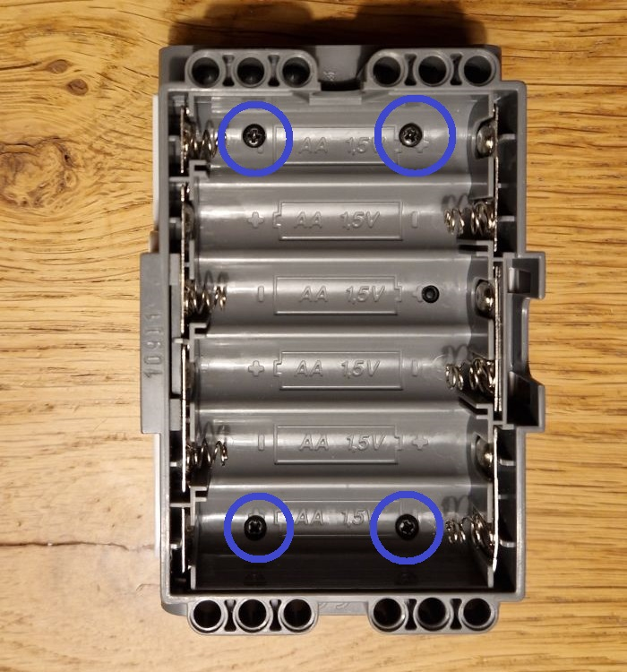
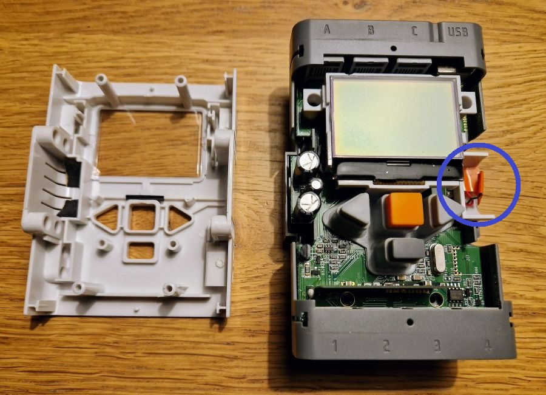
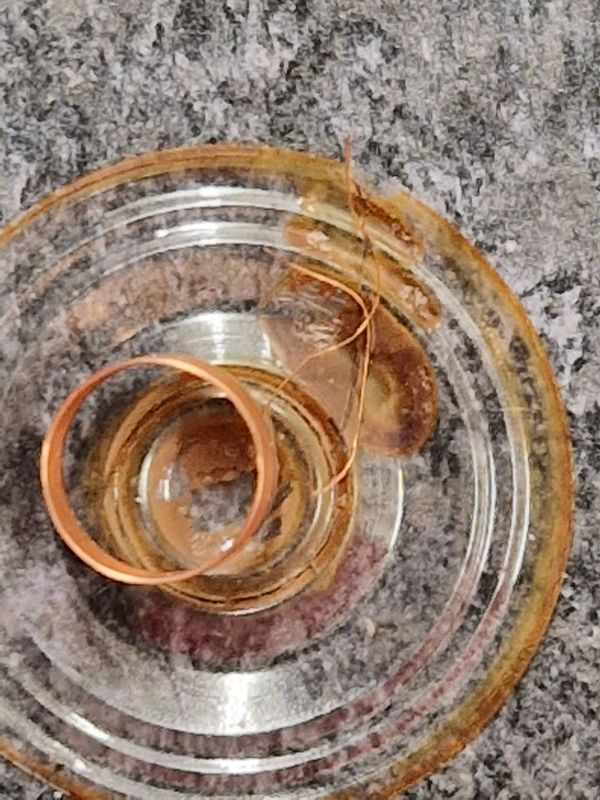
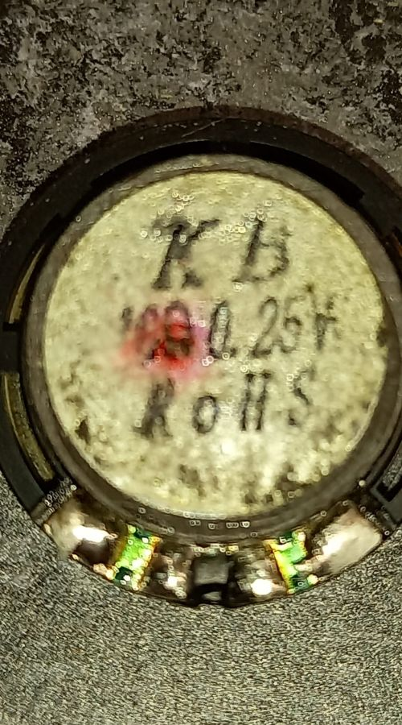
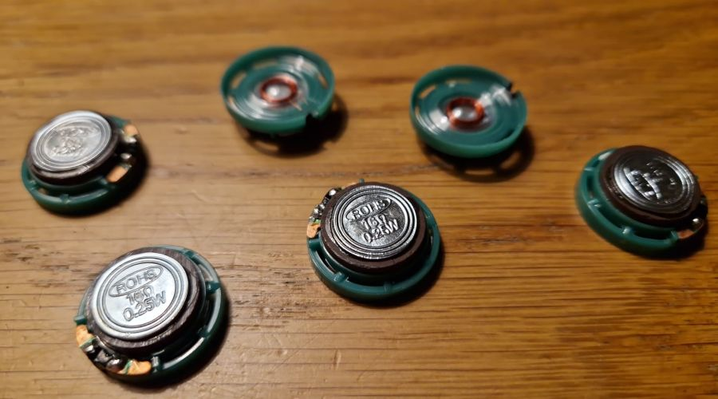

# Speaker repair

The first thing that broke on my NXTs was the speaker.

## Symptoms

The symptom: when switching on the NXT, we do not hear the startup sound.

Do make sure the brick volume is not switched off in _Brick menu_ > _Settings_ > _Volume_, select 4 or 3, but not 0.
I believe that it is possible to delete (even systems) sounds from the brick, 
so make sure _Brick menu_ > _My files_ > _Sound files_ > _!Startup_ is present.

## Opening the brick

We start by opening the brick via the 4 screws in the battery compartment.

Next step is to remove the white cover at the top, just shift it up.

On the right-hand side, we find the speaker. In the photo above, the double sided tape is removed
and the two wires desoldered. We notice that the speaker coil is loose.

At the back we find the specification: 16Ω, 0.25W, and diameter 21mm.

## Replacement part

I contacted LEGO customer service (jan 2024) but they couldn't help me on spare parts or 
even the specification of the speaker. We rely on the print we found on the old component,
and ordered from [AliExpress](https://www.aliexpress.com/item/4001285570204.html)
16Ω, 0.25W, and diameter 21mm.

I bought 6 pieces.

.

We resoldered the two wires. Polarity doesn't matter.

(end)
