# Install 

This page describes installing an IDE for the RCX (LEGO Mindstorms Robotics Invention System)
on a modern (2023) PC. Recall that the RCX came out 25 years earlier (in 1998).

The first option is to use an Open Source IDE. That is relatively easy, because that still 
runs on modern PCs/OSes.

The second option is to use the Original LEGO IDE. That is harder; I used a virtual machine 
with Win98.

Both require a bit of hardware to hookup the LEGO infra red tower: a DB9 serial connector.

Both require firmware for the RCX.


[Introduction](#introduction)

[RCX firmware](#rcx-firmware)

[DB9 connector](#db9-connector)

[Option 1: Open Source IDE](#option-1-open-source-ide)

[Option 2: LEGO IDE](#option-2-lego-ide)


## Introduction

The RCX contains two memories: ROM and RAM.
The ROM contains a bootloader, which starts running when the RCX is powered.
The bootloader checks if there is a valid RAM image - with "(flex) firmware" -
and if so runs that. The flex firmware controls the display and buttons. 
If the user presses the _Run_ button, the flex firmware will run the 
user application (there are five slots, and the _Prgm_ selects 
the slot/application to run). A second press on _Run_ stops the application.

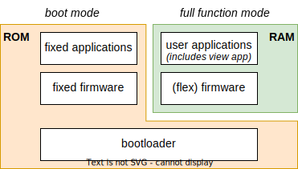

Since the flex firmware (and the user application) are in RAM, removing the 
batteries causes the RAM to lose them (there is a large capacitor inside 
the RCX, so actually you have 60 seconds to replace the batteries without 
losing RAM content). An RCX with empty RAM is known by LEGO as an RCX in _boot mode_. 

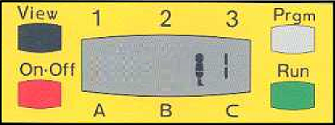

We can tell from the display if the RCX is in boot mode: it only shows 
the (running) man and the current slot (1 by default) to the right of the man. 
Once the flex firmware is loaded and the RCX is no longer in boot mode but
in _full function mode_, the display shows powered-on time (hours.minutes, 
begins with 00.00) left of the man.

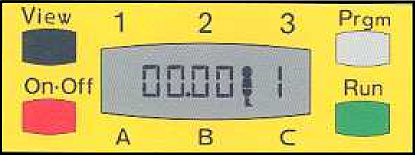

When the RCX is in boot mode (no flex firmware, no user application), the 
bootloader runs a small fixed firmware. This firmware also allows the user to 
select a slot with the _Prgm_ key and run and stop that with the _Run_ key. 
This runs one of the 5 fixed applications.

  1. RCX beeps, next motors A and C are powered
  
  2. Motors A and C are powered. While touch sensor 1 is pressed, A stops, while touch sensor 3 is pressed C stops.
  
  3. If light sensor on port 2 sees light, motors A and C are on, if it sees dark they are off.
  
  4. Motors A and C are on for 3 seconds (robot moves), motor A is reversed for 3 seconds and then reversed again (robot turns ~ 360 degrees), finally both motors are reversed
  for 3 seconds (robot moves back). This is repeated 5 times.

  5. Motors A and C are powered, when touch sensor on port 1 is pressed: reverse for 1 second, turn, and forwards again.

Also, in boot mode
 - The _View_ button is not working.
   I think the view application is a sixth application, with a dedicated button (_View_) 
   to start and stop it. This application comes with the flex firmware. 
   I assume the view apllication is part of the flex firmware 
   and the not fixed firmware, because LEGO can now add other sensors/actuators
   to the eco system, and update the view application to support viewing them.
   
   The _View_ button needs the flex firmware, but also the sensor ports need to be 
   configured in a mode matching the attached senor (a user program could/should do that).
   
 - You can **not** upload user applications in boot mode.
 
 - You can upload the flex firmware (takes several minutes).

See the [User guide RCX1.5](https://www.lego.com/cdn/product-assets/product.bi.core.pdf/4129418.pdf)
or the [Constructopedia RCX2.0](https://www.lego.com/cdn/product-assets/product.bi.core.pdf/4157492.pdf)
for official LEGO documentation on the RCX (firmware).


## RCX firmware

The (fixed) firmware is a crucial piece of software.
I have an RCX 1.0 (9719) and RCX 1.5 (9747).
They come with CDs which contain firmware files.

I also have an USB-to-IDE-adapter.
It is normally used to connect a bare harddisk to a PC via USB.
But I once rescued a DVD player from an old desktop.
It also has an IDE connector.
So I used the USB-to-IDE-adapter to connect a bare DVD reader to my laptop.

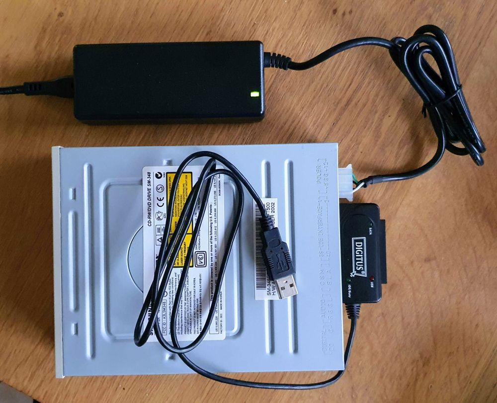

This enabled me to copy the RCX firmware files from the LEGO CDs 
and store a copy [here](firmware). Copies can also be found on the 
[pbricks](https://pbrick.info/rcx-firmware/index.html) site.


## DB9 connector 

There is one problem you likely have to tackle: connecting the LEGO infra red tower 
to your laptop. My IR towers are from mindstorms robotics invention 1.0 and 1.5. 
Both have a DB9 serial connector (male).

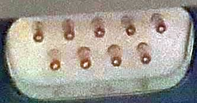

I have no experience with the IR tower in mindstrorms robot invention 2.0.
It has a USB connector. I suspect it comes with a driver, and that driver
is for Windows 98, so useless for modern Windows or Linux.

The mindstrorms robotics invention sets come with a female-to-female serial cable.
I therefore decided to buy a USB-to-serial cable with a DB9 _male_ connector.
This means that my "laptop with the USB-to-serial cable" now has a DB9 male plug,
just like the old PCs, and I can use the LEGO serial cable to connect the IR tower.

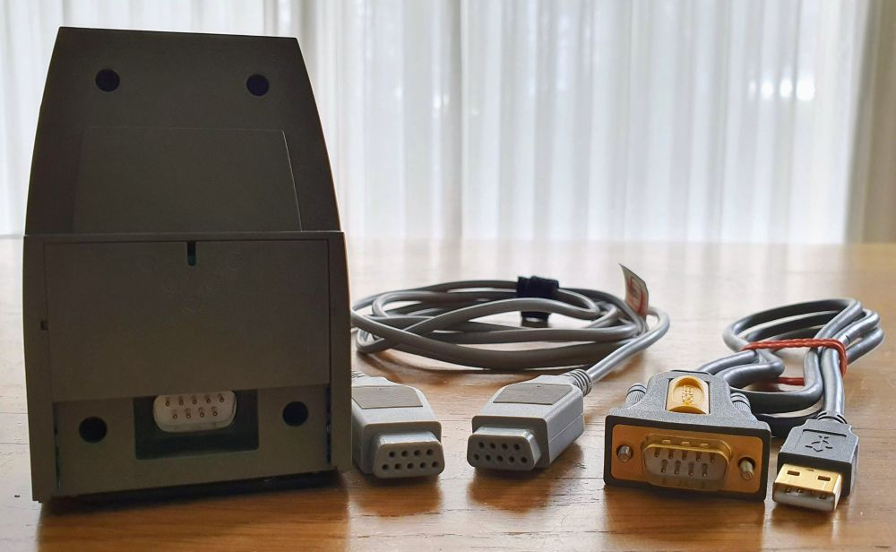

Alternatively, you could buy a USB-to-serial _female_ cable, and skip the 
LEGO cable. Not only do I believe my solution is more generic, I also had a
mechanical consideration: I suspect female cables won't fit in the IR tower 
due to the side screws that are usually present.

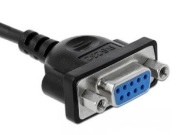

I bought my cable from **ugreen**. The US website no longer lists it, but the 
[Indonesian](https://ugreen.co.id/product/ugreen-usb-to-db9-rs-232-adapter-cable/) or
[Pakistan](https://ugreen.com.pk/product/ugreen-20222-usb-to-db9-rs-232-adapter-cable-2m/)
websites are.
It is available via e.g. amazon. It has a Prolific chip (PL2303) which is plug-and-play
with Windons 10 (so no driver problems). I do have FTDI cables, but not with DB9
connector, and I was also worried about voltage levels. Maybe the ugreen has a 
MAX232 level shifter, anyhow this cable works for me.

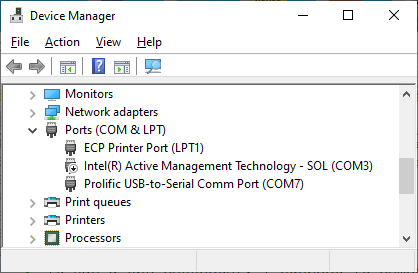


## Option 1: Open Source IDE

The easiets way to program the RCX is using open source software.
That still runs on modern PCs/OSes.

My suggested approach is Bricx Command Center [BricxCC](https://bricxcc.sourceforge.net/).
The download [link](https://sourceforge.net/projects/bricxcc/files/bricxcc/)
gives access to latest version (`bricxcc_setup_3389.exe`), which is from 2011-03-15
so I do not expect updates.

I installed BricxCC in `C:\programs\BricxCC` (still afraid of spaces in file paths);
and used "Typical" installation.

I plugged in the USB-to-DB9 cable, connected it with the LEGO serial cable
to the IR tower (which, of course, has a 9V battery), placed the IR tower in front of the RCX
(which, of course, has 6 times an AA battery), switched on the RCX (red _On-Off_ button),
and started BricxCC. The first pop-up is to find the RCX.

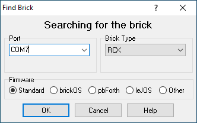

Make sure to select the correct COM port (see Device manager), and press OK.
If you get `No connection to programmable brick`, the USB-to-DB9 cable is not plugged-in 
(or has no driver), or it is not connected to the IR tower. If you get `Cannot find brick`, 
the RCX is not switched on, or not close enough (10cm). If all is fine, the green light in 
the IR tower lights up, confirming that BricxCC was successful in connecting to the tower.

The RCX is now likely in _boot mode_ (see Introduction, the RCX display 
does not show time left of the little man): we just placed batteries, so it contains no
firmware. **Warning:** as a result, most functions (tools) of BrickCC do _not_ work.
Running them typically causes a time-out (about 10sec) - and nothing happens.
It seems that only Tools > Diagnostics > Infrared Power seems to work somehow;
after waiting 10 seconds we can switch it to `Short` (and see the green LED on the tower
switched on for a short period).


Next step is to download the firmware. Select Tools > Download firmware, and browse 
to [`firm0332.lgo`](firm0332-RCX-education/firm0332.lgo). You will see the counter on 
the RCX display to run to 2494 (varies from firmware version to firmware version:
`firm0309.lgo` takes only 1638 steps - [video](https://www.youtube.com/shorts/t8wd-05d9GY)). 
This takes minutes. Note that flashing happens in blocks of 20 steps; I believe if 
such a block fails, it is retried, and finally aborted. This may happen if the distance
between tower and RCX does not match the distance settings (the switch at the bottom 
of the Tower, and configured in RCX, see above) or when there is too much ambient 
IR light (switch off lights in your room, close the curtains).

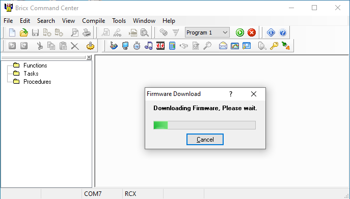

To test if the firmware is downloaded successfully, connect a motor to port A, and 
start Tools > Direct control. Press Motors > A > forward. This should start the motor.

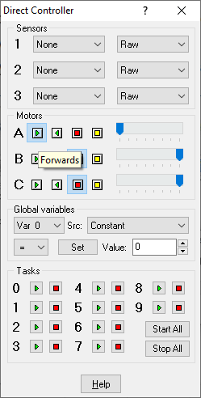

As a final test, we will write a Not Quite C program (NQC).
The default langauge of BricxCC is NXC, but I believe it is for the Lego second 
generation Mindstorms: NXT). So we set NQC as default.
Goto Edit > Preferences then in the Compiler tab and subtab Command check NQC:

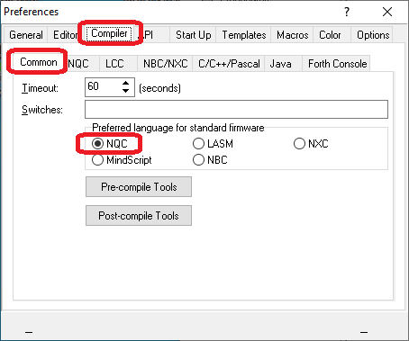

First we "build the robot": motor on port C, and touch sensor on port 3.
Secondly, we write a program that will run the motor clock wise or anti clockwise
depending on whether the touch sensor is pressed.

Select File > New, paste this [code](test.nqc) and
save this somewhere with extension `nqc`. The extension supplied with _save_ is
important for the compiler. Only then Compile > Compile.

```C
task main()
{
  SetSensorType(SENSOR_3, SENSOR_TYPE_TOUCH);
  SetSensorMode(SENSOR_3, SENSOR_MODE_BOOL);
  SetPower(OUT_C,1);
  while( 1 )
  {
    if( SensorValue(2) )
      OnFwd(OUT_C);
    else
      OnRev(OUT_C);
  }

}
```

Next select Compile > Download (or press F6 or press the button with the "radio" icon). 
This will upload the compiled program to the slot shown on the ribbon.

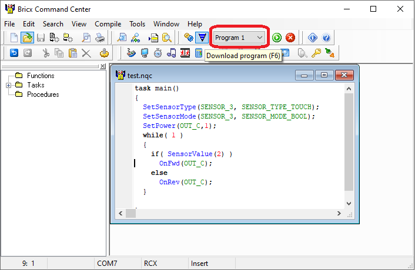

Finally, on the RCX, select slot 1 with the _Prgm_ button and then 
start the uploaded program by pressing the _Run_ button.
The motor attached to port C should start running. A press on the touch
sensor on port 3 should make it run the other way.
Press _Run_ again to stop the program.


## Option 2: LEGO IDE

Todo


(end)
